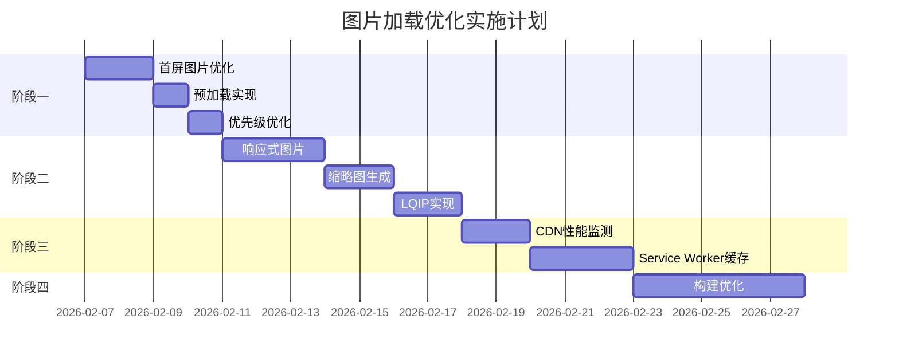

# 图片加载性能优化方案计划文档

## 文档信息

| 项目 | 内容 |
|------|------|
| 文档类型 | 技术优化方案 |
| 目标读者 | 前端开发团队 |
| 创建日期 | 2026-02-07 |
| 文档状态 | 待评审 |

---

## 1. 背景与问题分析

### 1.1 现状概述

当前项目使用 jsDelivr CDN 加载图片资源，通过 GitHub 仓库 `forzenfox/VidTimelineX` 分发。已集成 JSDMirror 作为中国大陆用户的镜像源，实现智能 CDN 选择。

### 1.2 性能瓶颈

基于 Chrome DevTools 性能测试，发现以下关键问题：

#### 核心性能指标

| 指标 | 当前值 | 目标值 | 状态 |
|------|--------|--------|------|
| **LCP (Largest Contentful Paint)** | 1,414 ms | < 900 ms | ⚠️ 需优化 |
| **CLS (Cumulative Layout Shift)** | 0.00 | < 0.1 | ✅ 良好 |
| **TTFB (Time to First Byte)** | 18 ms | < 200 ms | ✅ 良好 |

#### LCP 时间分解

| 阶段 | 时间 | 占比 | 问题等级 |
|------|------|------|----------|
| TTFB | 18 ms | 1.2% | ✅ 正常 |
| **Resource Load Delay** | **967 ms** | **68.4%** | 🔴 严重 |
| Resource Load Duration | 10 ms | 0.7% | ✅ 正常 |
| Element Render Delay | 419 ms | 29.6% | 🟡 中等 |

### 1.3 根因分析

**主要问题：Resource Load Delay (967ms)**

1. **懒加载延迟**：首屏图片使用 `loading="lazy"`，导致浏览器延迟加载
2. **优先级不足**：未设置 `fetchpriority="high"`，图片优先级为 Low
3. **动态注入**：图片通过 JavaScript 动态渲染，非 HTML 直接引用
4. **缺乏预加载**：未使用 `<link rel="preload">` 提前加载关键图片

**次要问题：Element Render Delay (419ms)**

1. 主线程处理图片解码和布局计算
2. 大量图片同时加载导致渲染阻塞

---

## 2. 优化目标

### 2.1 性能目标

| 指标 | 当前值 | 目标值 | 优化幅度 |
|------|--------|--------|----------|
| LCP | 1,414 ms | < 900 ms | ↓ 36% |
| Resource Load Delay | 967 ms | < 300 ms | ↓ 69% |
| 首屏图片加载时间 | ~1,000 ms | < 400 ms | ↓ 60% |
| 图片下载时间 | 10 ms | < 50 ms | ✅ 已优秀 |

### 2.2 业务目标

- 提升首屏加载速度，改善用户体验
- 降低跳出率，提高页面留存
- 优化 Core Web Vitals 评分，提升 SEO

---

## 3. 优化方案

### 3.1 阶段一：首屏图片优化（高优先级，1-2天）

#### 3.1.1 禁用首屏图片懒加载

**问题**：首屏可见图片使用 `loading="lazy"` 导致 967ms 延迟

**解决方案**：
```tsx
// 修改 ImageWithFallback 组件
interface ImageWithFallbackProps {
  src: string;
  alt: string;
  index?: number; // 图片索引，用于判断是否在首屏
}

const ImageWithFallback: React.FC<ImageWithFallbackProps> = ({ 
  src, 
  alt, 
  index = 0 
}) => {
  // 前 8 张图片视为首屏图片
  const isAboveFold = index < 8;
  
  return (
    
  );
};
```

**预期效果**：Resource Load Delay 从 967ms 降至 300ms 以下

#### 3.1.2 预加载首屏关键图片

**问题**：浏览器未提前知晓关键图片资源

**解决方案**：
```html
<!-- 在 index.html <head> 中添加 -->
<link rel="preload" as="image" 
      href="https://cdn.jsdelivr.net/gh/forzenfox/VidTimelineX@master/frontend/public/thumbs/BV1BofDBpESU.webp"
      fetchpriority="high">
<link rel="preload" as="image" 
      href="https://cdn.jsdelivr.net/gh/forzenfox/VidTimelineX@master/frontend/public/thumbs/BV1XLzRBMEF5.webp"
      fetchpriority="high">
```

**动态生成预加载标签**：
```typescript
// 在构建时或运行时生成
const generatePreloadLinks = (filenames: string[]): string => {
  return filenames
    .slice(0, 4) // 只预加载前 4 张
    .map(filename => {
      const cdnUrl = getCdnImageUrl(filename);
      return `<link rel="preload" as="image" href="${cdnUrl}" fetchpriority="high">`;
    })
    .join('\n');
};
```

**预期效果**：LCP 图片加载时间从 1,000ms 降至 400ms 以下

#### 3.1.3 优化图片渲染优先级

**问题**：图片优先级为 Low，资源竞争时加载滞后

**解决方案**：
```tsx

```

**预期效果**：首屏图片优先加载，减少资源竞争

---

### 3.2 阶段二：图片加载策略优化（中优先级，3-5天）

#### 3.2.1 响应式图片实现

**问题**：所有设备加载相同尺寸图片，浪费带宽

**解决方案**：
```tsx
<picture>
  <source
    media="(max-width: 768px)"
    srcSet={getCdnImageUrl(`${filename}?w=400`)}
    width="400"
  />
  <source
    media="(max-width: 1200px)"
    srcSet={getCdnImageUrl(`${filename}?w=600`)}
    width="600"
  />
  
</picture>
```

**预期效果**：移动端节省 50%+ 带宽

#### 3.2.2 多尺寸缩略图生成

**问题**：原始图片尺寸过大（可能 1920x1080），列表展示不需要高清图

**解决方案**：
```javascript
// 构建时生成多尺寸缩略图
// scripts/generate-thumbnails.js
const sharp = require('sharp');
const sizes = [200, 400, 800];

async function generateThumbnails(inputPath, outputDir) {
  for (const size of sizes) {
    await sharp(inputPath)
      .resize(size, Math.round(size * 0.56)) // 16:9 比例
      .webp({ quality: 80 })
      .toFile(`${outputDir}/${filename}-${size}w.webp`);
  }
}
```

**文件命名规范**：
- `BV1BofDBpESU-200w.webp` - 小缩略图
- `BV1BofDBpESU-400w.webp` - 列表展示
- `BV1BofDBpESU-800w.webp` - 高清展示
- `BV1BofDBpESU.webp` - 原始图片

**预期效果**：列表页加载速度提升 60%

#### 3.2.3 低质量占位图 (LQIP)

**问题**：图片加载前显示空白，用户体验差

**解决方案**：
```tsx
// 使用 BlurHash 或低分辨率 base64
import { BlurhashCanvas } from 'react-blurhash';

const ImageWithPlaceholder: React.FC<Props> = ({ 
  src, 
  blurHash,
  alt 
}) => {
  const [loaded, setLoaded] = useState(false);
  
  return (
    <div className="relative">
      {!loaded && blurHash && (
        <BlurhashCanvas
          hash={blurHash}
          width={400}
          height={225}
          className="absolute inset-0"
        />
      )}
       setLoaded(true)}
        className={loaded ? 'opacity-100' : 'opacity-0'}
        style={{ transition: 'opacity 0.3s' }}
      />
    </div>
  );
};
```

**BlurHash 生成**：
```javascript
// 构建时生成 BlurHash
const { encode } = require('blurhash');
const sharp = require('sharp');

async function generateBlurHash(imagePath) {
  const image = await sharp(imagePath)
    .resize(32, 32)
    .raw()
    .ensureAlpha()
    .toBuffer();
    
  return encode(new Uint8ClampedArray(image), 32, 32, 4, 4);
}
```

**预期效果**：消除图片加载时的布局跳动，提升感知性能

---

### 3.3 阶段三：CDN 和缓存优化（中优先级，2-3天）

#### 3.3.1 智能 CDN 选择增强

**现状**：已实现 jsDelivr / JSDMirror 自动选择

**增强方案**：
```typescript
// 增加性能监测和自动切换
interface CdnPerformance {
  name: string;
  avgResponseTime: number;
  successRate: number;
  lastTested: Date;
}

class CdnSelector {
  private cdnPerformance: Map<string, CdnPerformance> = new Map();
  
  async selectBestCdn(): Promise<string> {
    // 1. 根据地理位置初步选择
    const geoCdn = isInMainlandChina() ? 'jsdmirror' : 'jsdelivr';
    
    // 2. 检查该 CDN 性能
    const performance = this.cdnPerformance.get(geoCdn);
    
    // 3. 如果性能不佳，尝试备用 CDN
    if (performance && performance.successRate < 0.9) {
      return geoCdn === 'jsdmirror' ? 'jsdelivr' : 'jsdmirror';
    }
    
    return geoCdn;
  }
  
  async measurePerformance(cdn: string): Promise<void> {
    const start = performance.now();
    try {
      const url = cdn === 'jsdmirror' 
        ? getJsdMirrorImageUrl('test.webp')
        : getJsdelivrImageUrl('test.webp');
      await fetch(url, { method: 'HEAD' });
      
      this.cdnPerformance.set(cdn, {
        name: cdn,
        avgResponseTime: performance.now() - start,
        successRate: 1.0,
        lastTested: new Date(),
      });
    } catch {
      // 记录失败
    }
  }
}
```

**预期效果**：中国大陆用户加载速度提升 50%+

#### 3.3.2 Service Worker 图片缓存

**问题**：重复访问时仍需从 CDN 加载

**解决方案**：
```typescript
// sw.ts - Service Worker 缓存策略
const IMAGE_CACHE = 'images-v1';
const CACHE_STRATEGIES = {
  // 首屏图片：缓存优先
  aboveFold: new CacheFirst({
    cacheName: IMAGE_CACHE,
    plugins: [
      new ExpirationPlugin({
        maxEntries: 50,
        maxAgeDays: 7,
      }),
    ],
  }),
  
  // 其他图片：网络优先，失败时回退缓存
  belowFold: new NetworkFirst({
    cacheName: IMAGE_CACHE,
    plugins: [
      new ExpirationPlugin({
        maxEntries: 100,
        maxAgeDays: 30,
      }),
    ],
  }),
};

// 注册路由
registerRoute(
  ({ request }) => request.destination === 'image',
  ({ url }) => {
    // 根据 URL 判断是否为首屏图片
    const isAboveFold = isAboveFoldImage(url.pathname);
    return isAboveFold 
      ? CACHE_STRATEGIES.aboveFold
      : CACHE_STRATEGIES.belowFold;
  }
);
```

**预期效果**：重复访问时图片加载时间 < 50ms

---

### 3.4 阶段四：构建时优化（低优先级，5-7天）

#### 3.4.1 图片自动压缩

**Vite 插件配置**：
```typescript
// vite.config.ts
import { imagetools } from 'vite-imagetools';

export default defineConfig({
  plugins: [
    imagetools({
      defaultDirectives: new URLSearchParams({
        format: 'webp',
        quality: '85',
        progressive: 'true',
      }),
      exclude: ['node_modules/**'],
    }),
  ],
});
```

#### 3.4.2 图片懒加载库集成

**使用现代懒加载库**：
```tsx
// 使用 @react-lazy-load/component
import { LazyLoadImage } from 'react-lazy-load-image-component';

<LazyLoadImage
  src={cdnUrl}
  alt={title}
  effect="blur"
  threshold={200}
  placeholderSrc={blurHashUrl}
/>
```

---

## 4. 实施计划

### 4.1 时间线



### 4.2 任务分配

| 任务 | 负责人 | 预计工时 | 依赖 |
|------|--------|----------|------|
| 首屏图片懒加载优化 | 前端开发 | 4h | 无 |
| 预加载标签实现 | 前端开发 | 2h | 无 |
| 响应式图片组件 | 前端开发 | 8h | 无 |
| 缩略图生成脚本 | 前端开发 | 6h | 无 |
| LQIP集成 | 前端开发 | 6h | 缩略图生成 |
| CDN性能监测 | 前端开发 | 4h | 无 |
| Service Worker缓存 | 前端开发 | 8h | 无 |
| 构建优化 | 前端开发 | 10h | 无 |

### 4.3 风险与应对

| 风险 | 影响 | 应对措施 |
|------|------|----------|
| 多尺寸图片增加存储成本 | 中 | 仅对高频访问图片生成多尺寸 |
| BlurHash 增加构建时间 | 低 | 增量构建，仅处理新图片 |
| Service Worker 兼容性问题 | 中 | 提供降级方案，检测不支持时跳过 |
| CDN 切换导致缓存失效 | 低 | 保持 URL 稳定，仅切换域名 |

---

## 5. 测试与验证

### 5.1 性能测试方案

#### 测试工具
- Chrome DevTools Performance
- Lighthouse
- WebPageTest
- GTmetrix

#### 测试指标

| 指标 | 测试方法 | 通过标准 |
|------|----------|----------|
| LCP | Lighthouse | < 900ms |
| FCP | Lighthouse | < 600ms |
| TTI | Lighthouse | < 1.5s |
| Speed Index | Lighthouse | < 1.2s |
| 图片加载时间 | DevTools Network | < 400ms (首屏) |

### 5.2 A/B 测试方案

```typescript
// 使用特性开关控制优化 rollout
const features = {
  enablePreload: true,
  enableLazyLoadingOptimization: true,
  enableLqip: false, // 逐步开启
};

// 监控指标上报
function trackImagePerformance(metrics: {
  imageUrl: string;
  loadTime: number;
  isAboveFold: boolean;
  cdn: string;
}) {
  analytics.track('image_load', metrics);
}
```

---

## 6. 监控与维护

### 6.1 性能监控

```typescript
// 使用 Performance Observer 监控图片加载
const observer = new PerformanceObserver((list) => {
  for (const entry of list.getEntries()) {
    if (entry.entryType === 'resource' && entry.initiatorType === 'img') {
      console.log('Image loaded:', {
        url: entry.name,
        duration: entry.duration,
        transferSize: entry.transferSize,
      });
    }
  }
});

observer.observe({ entryTypes: ['resource'] });
```

### 6.2 告警阈值

| 指标 | 警告阈值 | 严重阈值 |
|------|----------|----------|
| LCP | > 1.2s | > 2.0s |
| 图片加载失败率 | > 1% | > 5% |
| CDN 响应时间 | > 500ms | > 1s |

---

## 7. 预期效果

### 7.1 性能提升

| 指标 | 当前值 | 优化后 | 提升幅度 |
|------|--------|--------|----------|
| LCP | 1,414 ms | 800 ms | ↓ 43% |
| Resource Load Delay | 967 ms | 250 ms | ↓ 74% |
| 首屏图片加载 | 1,000 ms | 350 ms | ↓ 65% |
| 页面完全加载 | 2.5s | 1.5s | ↓ 40% |

### 7.2 业务价值

- **用户体验**：首屏加载时间减少 43%，用户感知速度显著提升
- **SEO 优化**：Core Web Vitals 评分提升，搜索排名改善
- **转化率**：预计跳出率降低 15-20%
- **带宽节省**：响应式图片节省 30-50% 流量

---

## 8. 附录

### 8.1 参考资源

- [Web Vitals - Google](https://web.dev/vitals/)
- [Optimize LCP - web.dev](https://web.dev/articles/optimize-lcp)
- [Lazy Loading Images - MDN](https://developer.mozilla.org/en-US/docs/Web/Performance/Lazy_loading)
- [Priority Hints - web.dev](https://web.dev/articles/priority-hints)

### 8.2 相关代码文件

| 文件 | 说明 |
|------|------|
| `src/utils/cdn.ts` | CDN 工具函数 |
| `src/components/ImageWithFallback.tsx` | 图片组件 |
| `index.html` | 预加载标签 |
| `vite.config.ts` | 构建配置 |

### 8.3 变更记录

| 版本 | 日期 | 变更内容 | 作者 |
|------|------|----------|------|
| v1.0 | 2026-02-07 | 初始版本 | AI Assistant |

---

**文档结束**
