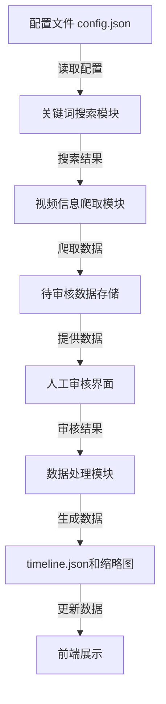

# 后端数据爬取与人工审核机制优化方案

## 1. 技术选型

### 1.1 核心技术栈
| 技术 | 版本 | 用途 | 选型理由 |
|------|------|------|---------|
| Python 3.8+ | - | 后端爬虫 | 强大的网络请求库、数据处理能力 |
| Requests | ^2.31.0 | HTTP请求 | 简洁易用、支持会话管理 |
| BeautifulSoup4 | ^4.12.3 | HTML解析 | 灵活的HTML/XML解析 |
| Flask | ^3.0.3 | 轻量级Web服务器 | 用于提供审核界面、简单易用 |
| Jinja2 | ^3.1.3 | 模板引擎 | 用于渲染审核界面 |
| Git | - | 版本控制 | 用于备份数据和版本管理 |
| Bilibili API | - | 视频信息获取 | 官方API更稳定、数据更完整 |

### 1.2 部署方案
- **本地项目**：负责数据爬取、处理和审核
- **代码仓库**：GitHub（可选）
- **构建工具**：Vite（前端）
- **部署平台**：GitHub Pages（前端，可选）
- **自动化工具**：本地脚本 + 手动触发

## 2. 系统架构

### 2.1 整体架构


### 2.2 模块划分
1. **配置管理模块**：管理关键词、爬取参数、审核配置
2. **关键词搜索模块**：根据关键词到B站搜索，获取视频列表
3. **视频信息爬取模块**：爬取视频信息和缩略图
4. **数据存储模块**：管理待审核、已审核、已拒绝的视频数据
5. **人工审核模块**：提供Web界面让用户审核视频
6. **数据处理模块**：处理审核通过的视频数据，生成timeline.json
7. **缩略图管理模块**：下载和管理视频缩略图
8. **前端展示模块**：展示审核结果和最终timeline

## 3. 核心功能实现

### 3.1 配置文件扩展
**扩展现有 `data/config.json`**：
```json
{
  "search": {
    "keywords": ["原神", "崩坏3", "星穹铁道"],
    "max_results": 20,
    "sort": "default",
    "time_range": "all"
  },
  "crawler": {
    "user_agent": "Mozilla/5.0 (Windows NT 10.0; Win64; x64) AppleWebKit/537.36 (KHTML, like Gecko) Chrome/91.0.4472.124 Safari/537.36",
    "delay_seconds": 1.0,
    "timeout": 15,
    "max_retries": 3
  },
  "review": {
    "auto_approve": false,
    "min_views": 0,
    "min_danmaku": 0,
    "categories": ["推荐", "一般", "不推荐"]
  },
  "output": {
    "title": "水墨风 视频时间线（Bilibili 示例）",
    "description": "点击卡片将在上方播放器中使用 B 站官方播放器播放视频（player.bilibili.com）。"
  }
}
```

### 3.2 数据存储结构
**新增文件**：
1. `data/pending.json`：待审核视频数据
2. `data/approved.json`：已审核通过视频数据
3. `data/rejected.json`：已拒绝视频数据

**数据结构**：
```json
{
  "videos": [
    {
      "url": "https://www.bilibili.com/video/BV1gk4y1r77A",
      "title": "视频标题",
      "description": "视频描述",
      "publish_date": "2023-01-01",
      "views": 10000,
      "danmaku": 500,
      "up主": "UP主名称",
      "thumbnail": "",
      "crawled_at": "2023-01-01 12:00:00",
      "review_status": "pending",
      "review_note": ""
    }
  ]
}
```

### 3.3 核心功能实现

#### 3.3.1 关键词搜索模块
**新增文件**：`backend/search_videos.py`
```python
#!/usr/bin/env python3
"""
关键词搜索模块，根据配置的关键词到B站搜索视频
"""

import json
import time
import requests
from pathlib import Path
from urllib.parse import urlencode

class VideoSearcher:
    def __init__(self, config_path):
        self.config_path = config_path
        self.config = self._load_config()
        self.headers = {
            'User-Agent': self.config['crawler']['user_agent'],
            'Accept': 'text/html,application/xhtml+xml,application/xml;q=0.9,*/*;q=0.8',
            'Accept-Language': 'zh-CN,zh;q=0.9,en;q=0.8'
        }
    
    def _load_config(self):
        with open(self.config_path, 'r', encoding='utf-8') as f:
            return json.load(f)
    
    def search_by_keyword(self, keyword):
        """根据关键词搜索视频"""
        search_url = "https://search.bilibili.com/video"
        params = {
            'keyword': keyword,
            'order': self.config['search']['sort'],
            'page': 1,
            'page_size': self.config['search']['max_results']
        }
        
        try:
            response = requests.get(search_url, params=params, headers=self.headers, timeout=15)
            response.raise_for_status()
            # 解析搜索结果，提取视频URL
            # 这里需要根据B站搜索页面的HTML结构进行解析
            # 简化实现，实际需要更复杂的解析逻辑
            video_urls = []
            # 示例：从HTML中提取视频URL
            # 实际实现需要使用BeautifulSoup解析
            return video_urls
        except Exception as e:
            print(f"搜索错误：{e}")
            return []
    
    def search_all_keywords(self):
        """搜索所有关键词"""
        all_urls = []
        keywords = self.config.get('search', {}).get('keywords', [])
        
        for keyword in keywords:
            print(f"搜索关键词：{keyword}")
            urls = self.search_by_keyword(keyword)
            all_urls.extend(urls)
            time.sleep(self.config['crawler']['delay_seconds'])
        
        # 去重
        all_urls = list(set(all_urls))
        print(f"共搜索到 {len(all_urls)} 个视频")
        return all_urls
    
    def save_search_results(self, output_path):
        """保存搜索结果到bv.txt"""
        urls = self.search_all_keywords()
        
        with open(output_path, 'w', encoding='utf-8') as f:
            for url in urls:
                f.write(f"{url}\n")
        
        print(f"搜索结果已保存到：{output_path}")
```

#### 3.3.2 人工审核模块
**新增文件**：`backend/review_server.py`
```python
#!/usr/bin/env python3
"""
人工审核服务器，提供Web界面让用户审核视频
"""

import json
import os
from pathlib import Path
from flask import Flask, render_template, request, redirect, url_for

app = Flask(__name__)

# 配置文件路径
CONFIG_PATH = Path('data/config.json')
PENDING_PATH = Path('data/pending.json')
APPROVED_PATH = Path('data/approved.json')
REJECTED_PATH = Path('data/rejected.json')
TIMELINE_PATH = Path('data/timeline.json')
THUMBS_DIR = Path('media/thumbs')

# 加载配置
def load_config():
    with open(CONFIG_PATH, 'r', encoding='utf-8') as f:
        return json.load(f)

# 加载数据
def load_data(path):
    if path.exists():
        with open(path, 'r', encoding='utf-8') as f:
            return json.load(f)
    return {'videos': []}

# 保存数据
def save_data(path, data):
    with open(path, 'w', encoding='utf-8') as f:
        json.dump(data, f, ensure_ascii=False, indent=2)

# 首页
@app.route('/')
def index():
    config = load_config()
    pending_data = load_data(PENDING_PATH)
    approved_data = load_data(APPROVED_PATH)
    rejected_data = load_data(REJECTED_PATH)
    
    return render_template('index.html', 
                          config=config,
                          pending_count=len(pending_data['videos']),
                          approved_count=len(approved_data['videos']),
                          rejected_count=len(rejected_data['videos']))

# 待审核列表
@app.route('/pending')
def pending():
    pending_data = load_data(PENDING_PATH)
    return render_template('pending.html', videos=pending_data['videos'])

# 审核操作
@app.route('/review/<int:video_id>', methods=['POST'])
def review(video_id):
    action = request.form.get('action')
    note = request.form.get('note', '')
    
    # 加载待审核数据
    pending_data = load_data(PENDING_PATH)
    if 0 <= video_id < len(pending_data['videos']):
        video = pending_data['videos'].pop(video_id)
        video['review_status'] = action
        video['review_note'] = note
        video['reviewed_at'] = time.strftime('%Y-%m-%d %H:%M:%S')
        
        # 保存到对应文件
        if action == 'approve':
            approved_data = load_data(APPROVED_PATH)
            approved_data['videos'].append(video)
            save_data(APPROVED_PATH, approved_data)
        elif action == 'reject':
            rejected_data = load_data(REJECTED_PATH)
            rejected_data['videos'].append(video)
            save_data(REJECTED_PATH, rejected_data)
        
        # 保存待审核数据
        save_data(PENDING_PATH, pending_data)
    
    return redirect(url_for('pending'))

# 生成timeline
@app.route('/generate')
def generate():
    # 加载已审核通过的视频
    approved_data = load_data(APPROVED_PATH)
    
    # 生成timeline.json
    # 这里需要调用现有的crawl_metadata.py逻辑
    # 简化实现，实际需要更复杂的处理
    
    return redirect(url_for('index'))

# 静态文件
@app.route('/static/<path:path>')
def static_file(path):
    return app.send_static_file(path)

if __name__ == '__main__':
    # 创建必要的目录
    os.makedirs('templates', exist_ok=True)
    os.makedirs('static', exist_ok=True)
    
    # 启动服务器
    app.run(debug=True, host='localhost', port=5000)
```

#### 3.3.3 审核界面模板
**新增文件**：`backend/templates/index.html`
```html
<!DOCTYPE html>
<html lang="zh-CN">
<head>
    <meta charset="UTF-8">
    <meta name="viewport" content="width=device-width, initial-scale=1.0">
    <title>视频审核系统</title>
    <style>
        body {
            font-family: Arial, sans-serif;
            margin: 20px;
            background-color: #f5f5f5;
        }
        .container {
            max-width: 800px;
            margin: 0 auto;
            background-color: white;
            padding: 20px;
            border-radius: 8px;
            box-shadow: 0 0 10px rgba(0,0,0,0.1);
        }
        .stats {
            display: flex;
            justify-content: space-around;
            margin: 20px 0;
        }
        .stat-box {
            text-align: center;
            padding: 20px;
            background-color: #f0f0f0;
            border-radius: 8px;
        }
        .btn {
            display: inline-block;
            padding: 10px 20px;
            background-color: #4CAF50;
            color: white;
            text-decoration: none;
            border-radius: 4px;
            margin: 5px;
        }
        .btn:hover {
            background-color: #45a049;
        }
        .btn-secondary {
            background-color: #008CBA;
        }
        .btn-secondary:hover {
            background-color: #007bb5;
        }
    </style>
</head>
<body>
    <div class="container">
        <h1>视频审核系统</h1>
        <p>欢迎使用视频审核系统，您可以在这里审核自动爬取的视频，决定是否添加到最终的时间线中。</p>
        
        <div class="stats">
            <div class="stat-box">
                <h3>待审核</h3>
                <p>{{ pending_count }}</p>
                <a href="/pending" class="btn">查看</a>
            </div>
            <div class="stat-box">
                <h3>已通过</h3>
                <p>{{ approved_count }}</p>
            </div>
            <div class="stat-box">
                <h3>已拒绝</h3>
                <p>{{ rejected_count }}</p>
            </div>
        </div>
        
        <div style="text-align: center; margin-top: 30px;">
            <a href="/generate" class="btn">生成时间线</a>
        </div>
    </div>
</body>
</html>
```

**新增文件**：`backend/templates/pending.html`
```html
<!DOCTYPE html>
<html lang="zh-CN">
<head>
    <meta charset="UTF-8">
    <meta name="viewport" content="width=device-width, initial-scale=1.0">
    <title>待审核视频</title>
    <style>
        body {
            font-family: Arial, sans-serif;
            margin: 20px;
            background-color: #f5f5f5;
        }
        .container {
            max-width: 1000px;
            margin: 0 auto;
            background-color: white;
            padding: 20px;
            border-radius: 8px;
            box-shadow: 0 0 10px rgba(0,0,0,0.1);
        }
        .video-item {
            border: 1px solid #ddd;
            border-radius: 8px;
            padding: 15px;
            margin: 10px 0;
            background-color: #f9f9f9;
        }
        .video-title {
            font-size: 18px;
            font-weight: bold;
            margin-bottom: 10px;
        }
        .video-info {
            margin-bottom: 10px;
            font-size: 14px;
            color: #666;
        }
        .video-actions {
            margin-top: 15px;
        }
        .btn {
            display: inline-block;
            padding: 8px 16px;
            text-decoration: none;
            border-radius: 4px;
            margin-right: 10px;
            font-size: 14px;
        }
        .btn-approve {
            background-color: #4CAF50;
            color: white;
        }
        .btn-reject {
            background-color: #f44336;
            color: white;
        }
        .btn-back {
            background-color: #008CBA;
            color: white;
        }
        .form-group {
            margin: 10px 0;
        }
        textarea {
            width: 100%;
            padding: 10px;
            border: 1px solid #ddd;
            border-radius: 4px;
            resize: vertical;
            min-height: 80px;
        }
        img {
            max-width: 200px;
            max-height: 150px;
            margin: 10px 0;
        }
    </style>
</head>
<body>
    <div class="container">
        <h1>待审核视频</h1>
        <a href="/" class="btn btn-back">返回首页</a>
        
        
            
                <div class="video-item">
                    <div class="video-title">{{ video.title }}</div>
                    <div class="video-info">
                        <p>URL: <a href="{{ video.url }}" target="_blank">{{ video.url }}</a></p>
                        <p>发布时间: {{ video.publish_date }}</p>
                        <p>播放量: {{ video.views }}</p>
                        <p>弹幕数: {{ video.danmaku }}</p>
                        <p>UP主: {{ video.up主 }}</p>
                    </div>
                    
                        
                    
                    <form class="video-actions" action="/review/{{ loop.index0 }}" method="post">
                        <div class="form-group">
                            <label for="note-{{ loop.index0 }}">备注：</label>
                            <textarea id="note-{{ loop.index0 }}" name="note" placeholder="请输入备注信息"></textarea>
                        </div>
                        <button type="submit" name="action" value="approve" class="btn btn-approve">通过</button>
                        <button type="submit" name="action" value="reject" class="btn btn-reject">拒绝</button>
                    </form>
                </div>
            
        
            <p>暂无待审核视频</p>
        
    </div>
</body>
</html>
```

#### 3.3.4 数据处理模块
**修改文件**：`backend/crawl_metadata.py`
- 扩展现有功能，支持从待审核数据中读取视频
- 增加审核状态管理
- 优化数据处理逻辑

#### 3.3.5 自动化脚本
**新增文件**：`backend/auto_crawl.py`
```python
#!/usr/bin/env python3
"""
自动化爬取脚本，整合搜索、爬取、审核流程
"""

import json
import time
import subprocess
from pathlib import Path

class AutoCrawler:
    def __init__(self, config_path):
        self.config_path = config_path
        self.config = self._load_config()
    
    def _load_config(self):
        with open(self.config_path, 'r', encoding='utf-8') as f:
            return json.load(f)
    
    def run(self):
        """运行完整流程"""
        try:
            print("开始自动化爬取流程...")
            
            # 1. 搜索视频
            print("1. 搜索视频...")
            search_script = Path(__file__).parent / "search_videos.py"
            subprocess.run(["python", str(search_script)], check=True)
            
            # 2. 爬取视频信息
            print("2. 爬取视频信息...")
            crawl_script = Path(__file__).parent / "crawl_metadata.py"
            subprocess.run(["python", str(crawl_script)], check=True)
            
            # 3. 启动审核服务器
            print("3. 启动审核服务器...")
            print("请打开浏览器访问 http://localhost:5000 进行视频审核")
            print("审核完成后，点击 '生成时间线' 按钮生成最终的timeline.json")
            
            # 启动审核服务器
            review_script = Path(__file__).parent / "review_server.py"
            subprocess.run(["python", str(review_script)], check=True)
            
        except Exception as e:
            print(f"错误：{e}")

if __name__ == "__main__":
    crawler = AutoCrawler("data/config.json")
    crawler.run()
```

## 4. 系统流程

### 4.1 整体流程
1. **配置阶段**：用户在 `config.json` 中配置关键词、爬取参数等
2. **搜索阶段**：系统根据配置的关键词到B站搜索视频
3. **爬取阶段**：系统爬取搜索到的视频信息和缩略图
4. **存储阶段**：系统将爬取的视频存储到 `pending.json` 中
5. **审核阶段**：用户通过Web界面审核视频，决定是否通过
6. **生成阶段**：系统根据审核通过的视频生成 `timeline.json`
7. **展示阶段**：前端展示最终的时间线

### 4.2 审核流程
1. **启动审核服务器**：运行 `review_server.py`
2. **访问审核界面**：打开浏览器访问 `http://localhost:5000`
3. **查看待审核视频**：点击 "待审核" 查看待审核视频列表
4. **审核视频**：对每个视频进行审核，选择 "通过" 或 "拒绝"
5. **生成时间线**：审核完成后，点击 "生成时间线" 按钮
6. **停止服务器**：生成完成后，停止审核服务器

## 5. 技术难点与解决方案

### 5.1 B站搜索API限制
- **问题**：B站搜索API可能有请求频率限制
- **解决方案**：
  - 合理设置请求间隔
  - 使用随机User-Agent
  - 实现请求重试机制
  - 优先使用页面解析而非API

### 5.2 视频信息提取
- **问题**：B站页面结构可能变化，导致信息提取失败
- **解决方案**：
  - 实现多种信息提取方法
  - 增加错误处理和兜底逻辑
  - 定期更新解析规则

### 5.3 人工审核界面
- **问题**：需要提供一个简单易用的审核界面
- **解决方案**：
  - 使用Flask提供轻量级Web服务
  - 设计简洁的HTML模板
  - 支持基本的审核操作
  - 提供视频预览功能

### 5.4 数据管理
- **问题**：需要管理大量的视频数据，包括待审核、已审核、已拒绝的视频
- **解决方案**：
  - 使用JSON文件存储数据
  - 实现数据分类管理
  - 提供数据清理功能
  - 支持数据导出和备份

### 5.5 性能优化
- **问题**：爬取和审核过程可能较慢
- **解决方案**：
  - 实现并发爬取
  - 使用异步IO
  - 缓存搜索结果
  - 优化数据库操作

## 6. 安全性考虑

### 6.1 网络安全
- **问题**：爬取过程中可能遇到网络安全问题
- **解决方案**：
  - 使用HTTPS请求
  - 验证SSL证书
  - 避免使用不安全的代理
  - 合理设置请求头

### 6.2 数据安全
- **问题**：用户数据需要安全存储
- **解决方案**：
  - 使用本地文件存储，避免云端存储
  - 定期备份数据
  - 避免存储敏感信息
  - 清理临时数据

### 6.3 系统安全
- **问题**：审核服务器需要安全运行
- **解决方案**：
  - 仅在本地运行，不对外暴露
  - 使用Flask的调试模式（仅开发环境）
  - 限制访问IP
  - 定期更新依赖

## 7. 扩展性考虑

### 7.1 功能扩展
- **支持更多视频平台**：扩展搜索模块，支持YouTube、优酷等平台
- **自动分类**：实现视频自动分类功能
- **智能推荐**：基于用户审核历史，实现智能推荐
- **定时任务**：支持定时自动爬取和审核

### 7.2 配置扩展
- **支持更多搜索参数**：如时间范围、视频时长等
- **审核规则配置**：如自动审核规则、评分标准等
- **通知配置**：如审核完成通知、爬取完成通知等

### 7.3 界面扩展
- **响应式设计**：支持移动设备访问
- **深色模式**：支持深色主题
- **多语言支持**：支持中英文切换
- **自定义样式**：支持用户自定义界面样式

## 8. 部署与使用

### 8.1 部署步骤
1. **安装依赖**：
   ```bash
   pip install -r requirements.txt
   ```

2. **配置文件**：编辑 `data/config.json`，配置关键词、爬取参数等

3. **创建目录**：
   ```bash
   mkdir -p backend/templates backend/static
   ```

4. **复制模板文件**：将HTML模板文件复制到 `backend/templates` 目录

5. **运行脚本**：
   ```bash
   python backend/auto_crawl.py
   ```

6. **审核视频**：打开浏览器访问 `http://localhost:5000` 进行视频审核

7. **生成时间线**：审核完成后，点击 "生成时间线" 按钮

8. **前端构建**：
   ```bash
   cd frontend
   npm run build
   ```

9. **部署到GitHub Pages**：将构建产物推送到GitHub仓库的gh-pages分支

### 8.2 使用说明
1. **配置关键词**：在 `config.json` 的 `search.keywords` 中添加要搜索的关键词
2. **调整参数**：根据需要调整爬取参数、审核配置等
3. **运行脚本**：执行 `auto_crawl.py` 开始爬取流程
4. **审核视频**：在Web界面中审核视频，决定是否通过
5. **生成时间线**：审核完成后生成最终的时间线
6. **查看结果**：打开前端页面查看最终的时间线

## 9. 性能优化

### 9.1 爬取优化
- **并发爬取**：使用 `concurrent.futures` 实现并发爬取
- **异步IO**：使用 `asyncio` 和 `aiohttp` 实现异步请求
- **缓存机制**：缓存已爬取的视频信息，避免重复爬取
- **批量处理**：批量处理搜索结果，减少网络请求次数

### 9.2 审核优化
- **分页显示**：大量视频时使用分页显示，提高加载速度
- **异步加载**：使用AJAX异步加载视频信息，提高用户体验
- **批量操作**：支持批量审核操作，提高审核效率
- **快捷键支持**：支持键盘快捷键，提高操作速度

### 9.3 生成优化
- **增量生成**：只处理新增的审核通过视频，减少处理时间
- **并行处理**：并行处理视频信息和缩略图，提高生成速度
- **缓存优化**：缓存生成结果，避免重复生成
- **压缩优化**：压缩生成的JSON文件，减少文件大小

## 10. 监控与日志

### 10.1 日志系统
- **爬取日志**：记录爬取过程中的错误和警告
- **审核日志**：记录审核操作和结果
- **生成日志**：记录生成过程中的错误和警告
- **系统日志**：记录系统启动、停止等事件

### 10.2 监控指标
- **爬取成功率**：监控视频爬取的成功率
- **审核通过率**：监控视频审核的通过率
- **生成时间**：监控时间线生成的时间
- **系统状态**：监控系统的运行状态

### 10.3 错误处理
- **网络错误**：处理网络请求失败的情况
- **解析错误**：处理页面解析失败的情况
- **存储错误**：处理数据存储失败的情况
- **审核错误**：处理审核操作失败的情况

## 11. 结论

本优化方案在保持现有核心功能不变的基础上，增加了人工审核机制，使系统更加适合个人用户使用。方案具有以下特点：

1. **简洁易用**：使用轻量级技术栈，部署简单，操作方便
2. **功能完整**：包含关键词搜索、视频爬取、人工审核、时间线生成等完整功能
3. **可扩展性**：支持功能扩展和配置调整，满足不同用户的需求
4. **安全性**：使用本地存储，避免云端依赖，保障数据安全
5. **性能优化**：实现并发爬取、异步IO等优化，提高系统性能

通过本方案，用户可以：
- 自动根据关键词搜索B站视频
- 批量爬取视频信息和缩略图
- 通过Web界面直观地审核视频
- 灵活控制最终展示的视频内容
- 快速生成和部署时间线

方案适合个人用户使用，无需专业技术背景，操作简单直观，同时具有足够的灵活性和可扩展性，可以根据用户的需求进行调整和扩展。