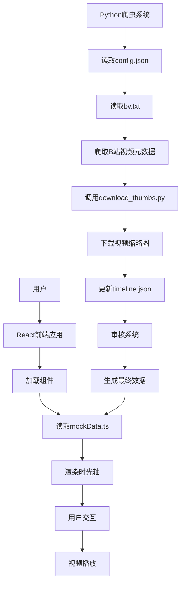

# 时光视频集 (Mohen Time Video Collection) 项目分析文档

## 1. 仓库概览

时光视频集是一个基于网页的视频时光轴展示系统，主要用于展示和管理主播视频的时光轴集合，方便粉丝群体了解主播的视频历史。项目已从原始的静态HTML/CSS/JS架构升级为现代化的React + TypeScript + Vite前端架构，同时保留了Python后端爬虫系统。

### 主要功能与亮点
- 从B站(Bilibili)爬取视频元数据（标题、发布时间）
- 自动下载和管理视频缩略图
- 以时光轴形式展示视频历史，带有动画效果
- 响应式设计，支持平板和桌面设备浏览
- 美观的UI界面，采用双主题设计（Tiger霸气主题和Sweet甜筒主题）
- 支持视频播放（使用B站官方嵌入播放器）
- 弹幕欢迎效果和侧边栏弹幕系统
- 视频分类筛选和搜索功能
- 无版权字体，适合非商业用途

### 典型应用场景
- 粉丝群体收藏和回顾主播的视频历史
- 内容创作者整理自己的作品时间线
- 视频内容的时间顺序展示和管理

## 2. 目录结构

时光视频集项目采用清晰的目录结构，将前端和后端代码分离，便于维护和扩展。前端部分负责数据展示和用户交互，后端部分负责数据采集和处理。

```text
bilibili-timeline/
├── backend/                    # 后端代码目录
│   ├── data/                  # 数据存储目录
│   │   ├── approved.json      # 已审核通过的视频数据
│   │   ├── pending.json       # 待审核视频数据
│   │   └── rejected.json      # 已拒绝视频数据
│   ├── templates/             # Flask模板目录
│   │   ├── approved.html      # 已审核页面
│   │   ├── index.html         # 审核系统首页
│   │   ├── pending.html       # 待审核页面
│   │   └── rejected.html      # 已拒绝页面
│   ├── auto_crawler.py        # 自动化爬取脚本
│   ├── crawl_metadata.py      # 视频元数据爬虫
│   ├── download_thumbs.py     # 缩略图下载脚本
│   └── test_*.py             # 测试脚本
├── data/                      # 原始数据目录
│   ├── bv.txt                 # B站视频BV号列表
│   ├── config.json            # 爬虫配置文件
│   └── timeline.json          # 生成的时光轴数据
├── docs/                      # 文档目录
│   ├── 项目分析文档.md        # 项目分析文档（本文件）
│   ├── UI设计文档.md          # UI设计文档
│   ├── 技术调研计划.md        # 技术调研计划
│   └── ...                   # 其他文档
├── media/                     # 媒体文件目录
│   └── thumbs/                # 缩略图存储目录
├── react/                     # React前端项目
│   ├── public/                # 静态资源目录
│   ├── src/                   # 源代码目录
│   │   ├── components/        # 组件目录
│   │   │   ├── ui/           # UI基础组件（Radix UI）
│   │   │   ├── DanmakuWelcome.tsx    # 弹幕欢迎组件
│   │   │   ├── DeviceDemo.tsx         # 设备演示组件
│   │   │   ├── HorizontalDanmu.tsx    # 水平弹幕组件
│   │   │   ├── SidebarDanmu.tsx       # 侧边栏弹幕组件
│   │   │   ├── ThemeToggle.tsx        # 主题切换组件
│   │   │   ├── TimelineItem.tsx       # 时间线项组件
│   │   │   ├── VideoCard.tsx          # 视频卡片组件
│   │   │   └── VideoModal.tsx         # 视频模态框组件
│   │   ├── data/           # 数据目录
│   │   │   └── mockData.ts # 模拟数据
│   │   ├── fonts/          # 字体文件目录
│   │   ├── hooks/          # 自定义Hooks
│   │   ├── lib/            # 工具库
│   │   ├── pages/          # 页面组件
│   │   ├── App.tsx         # 主应用组件
│   │   ├── main.tsx        # 入口文件
│   │   └── index.css       # 全局样式
│   ├── package.json        # 前端依赖配置
│   ├── vite.config.ts      # Vite配置
│   └── tailwind.config.js  # Tailwind CSS配置
├── requirements.txt         # Python依赖
└── README.md               # 项目说明
```

### 目录职责说明

| 目录/文件 | 职责说明 |
|---------|---------|
| backend/ | 后端爬虫和审核系统代码 |
| backend/data/ | 存储审核状态的视频数据 |
| backend/templates/ | Flask审核界面模板 |
| data/ | 原始数据存储目录 |
| data/config.json | 爬虫配置，包括用户代理、延迟时间、超时设置等 |
| data/timeline.json | 生成的时光轴数据，包含视频标题、发布时间、URL和缩略图路径等 |
| media/thumbs/ | 存储下载的视频缩略图 |
| react/ | React前端项目目录 |
| react/src/components/ | 前端组件，包括UI组件和业务组件 |
| react/src/data/mockData.ts | 模拟数据（当前未对接后端） |
| react/src/hooks/ | 自定义React Hooks，如设备检测、动态组件加载等 |
| react/src/pages/ | 页面组件，如Home、NotFound等 |
| docs/ | 项目文档，包括技术调研、UI设计等 |
| crawl_metadata.py | 视频元数据爬虫，从B站爬取视频标题和发布时间 |
| download_thumbs.py | 缩略图下载脚本，自动下载和处理视频缩略图 |

## 3. 系统架构与主流程

时光视频集项目采用前后端分离的架构设计，后端使用Python脚本进行数据采集和处理，前端使用React + TypeScript + Vite进行数据展示和用户交互。

### 3.1 系统架构图



### 3.2 主要数据流

1. **数据采集流程**
   - 用户编辑 `data/bv.txt` 文件，添加要爬取的B站视频URL
   - 运行 `crawl_metadata.py` 脚本
   - 脚本读取 `config.json` 配置和 `bv.txt` 中的URL
   - 爬取B站视频元数据（标题、发布时间）
   - 调用 `download_thumbs.py` 下载视频缩略图
   - 生成或更新 `timeline.json` 文件
   - 通过审核系统（Flask）审核视频数据

2. **数据展示流程**
   - 用户访问React前端应用
   - 应用加载 `mockData.ts` 模拟数据（当前未对接后端）
   - 以时光轴形式渲染视频数据
   - 用户点击卡片或时间线点，触发视频播放

### 3.3 系统分层

- **数据采集层**：Python爬虫脚本，负责从B站获取视频元数据和缩略图
- **数据审核层**：Flask审核系统，提供Web界面进行视频审核
- **数据存储层**：JSON文件，存储配置信息和时光轴数据
- **前端展示层**：React + TypeScript + Vite，负责数据渲染和用户交互
- **用户交互层**：时光轴界面、视频播放器、弹幕系统，提供用户操作入口

## 4. 核心功能模块

### 4.1 视频元数据爬虫模块

**功能说明**：从B站爬取视频的标题和发布时间等元数据信息。

**实现原理**：
- 使用 `requests` 库发送HTTP请求获取B站视频页面
- 使用 `BeautifulSoup4` 库解析HTML页面内容
- 从多个位置提取视频标题和发布时间
- 当无法获取发布时间时，使用当前日期作为默认值
- 支持robots.txt协议检查
- 实现重试机制和错误处理

**关键代码**：
```python
# crawl_metadata.py 中的视频元数据爬取函数
def crawl_video_metadata(self, url):
    max_retries = self.config['crawler']['max_retries']
    timeout = self.config['crawler']['timeout']
    
    for retry in range(max_retries):
        try:
            print(f"爬取视频：{url} (尝试 {retry+1}/{max_retries})")
            response = requests.get(url, headers=self.headers, timeout=timeout)
            response.raise_for_status()
            
            soup = BeautifulSoup(response.text, 'html.parser')
            
            # 提取视频元数据
            metadata = {
                'url': url,
                'type': 'bilibili',
                'title': self._extract_title(soup),
                'description': '',  # 默认设置为空
                'publish_date': self._extract_publish_date(soup)
            }
            
            print(f"成功爬取视频：{metadata['title']}")
            return metadata
            
        except requests.exceptions.RequestException as e:
            print(f"网络错误：{e}")
            if retry < max_retries - 1:
                print(f"等待 {self.config['crawler']['delay_seconds']} 秒后重试...")
                time.sleep(self.config['crawler']['delay_seconds'])
            else:
                print(f"错误：爬取 {url} 失败，已达到最大重试次数")
                return None
        except Exception as e:
            print(f"解析错误：{e}")
            return None
```

### 4.2 缩略图下载模块

**功能说明**：自动从B站视频页面下载视频缩略图，并更新时光轴数据中的缩略图路径。

**实现原理**：
- 从视频页面提取 og:image 或 twitter:image 元数据
- 确保URL协议正确
- 下载缩略图到本地存储
- 计算相对路径并更新 timeline.json 文件
- 实现Unicode转义处理

**关键代码**：
```python
# download_thumbs.py 中的缩略图下载函数
def download_binary(url: str, outpath: Path):
    headers = {"User-Agent": "Mozilla/5.0 (thumb-fetcher)"}
    with requests.get(url, headers=headers, stream=True, timeout=20) as r:
        r.raise_for_status()
        outpath.parent.mkdir(parents=True, exist_ok=True)
        with outpath.open("wb") as f:
            for chunk in r.iter_content(chunk_size=8192):
                if chunk:
                    f.write(chunk)
```

### 4.3 React前端时光轴展示模块

**功能说明**：以时光轴形式展示视频历史，支持动画效果和响应式设计。

**实现原理**：
- 使用React组件化开发
- 动态生成时间线点和卡片
- 实现平滑滚动和动画效果
- 响应式设计，适配不同屏幕尺寸
- 支持设备检测和动态组件加载

**关键代码**：
```tsx
// TimelineItem.tsx 中的时间线项组件
export const TimelineItem: React.FC<TimelineItemProps> = ({ 
  date, 
  videos, 
  isLast = false, 
  onVideoClick, 
  theme 
}) => {
  const primaryColor = theme === 'tiger' ? 'rgb(255, 95, 0)' : 'rgb(255, 140, 180)';
  const secondaryColor = theme === 'tiger' ? 'rgb(255, 190, 40)' : 'rgb(255, 192, 203)';

  return (
    <div className="relative pb-12">
      <div className="flex gap-8">
        {/* 时间线左侧 - 日期标记 */}
        <div className="hidden md:flex-shrink-0 w-32 text-right">
          <div className="sticky top-24">
            <div 
              className="inline-block text-white px-4 py-2 rounded-lg shadow-lg"
              style={{
                background: `linear-gradient(135deg, ${primaryColor}, ${secondaryColor})`,
              }}
            >
              <div className="text-sm opacity-90">日期</div>
              <div className="font-bold">{date}</div>
            </div>
          </div>
        </div>

        {/* 时间线中间 - 连接线和节点 */}
        <div className="flex-shrink-0 flex flex-col items-center">
          <div 
            className="w-7 h-7 rounded-full shadow-lg ring-4 ring-white z-10 transition-transform hover:scale-125"
            style={{
              background: `linear-gradient(135deg, ${primaryColor}, ${secondaryColor})`,
            }}
          />
          {!isLast && (
            <div 
              className="w-1.5 flex-1 opacity-40 mt-2 shadow-sm"
              style={{
                background: `linear-gradient(to bottom, ${primaryColor}, ${secondaryColor})`,
              }}
            />
          )}
        </div>

        {/* 时间线右侧 - 视频卡片 */}
        <div className="flex-1 grid grid-cols-1 sm:grid-cols-2 lg:grid-cols-3 gap-4 sm:gap-6">
          {videos.map((video) => (
            <VideoCard 
              key={video.id} 
              video={video} 
              onClick={onVideoClick} 
            />
          ))}
        </div>
      </div>
    </div>
  );
};
```

### 4.4 视频播放模块

**功能说明**：支持视频播放，使用B站官方嵌入播放器。

**实现原理**：
- 使用React模态框组件
- 解析视频URL，提取BV号
- 创建B站播放器iframe
- 支持自动播放和全屏
- 实现弹窗播放模式
- 支持ESC键关闭

**关键代码**：
```tsx
// VideoModal.tsx 中的视频播放组件
const VideoModal: React.FC<VideoModalProps> = ({ video, onClose, theme = 'tiger' }) => {
  const [isLoading, setIsLoading] = useState(true);
  
  // 生成模拟的 bvid
  const mockBvid = `BV${Math.random().toString(36).substring(2, 13).toUpperCase()}`;

  return (
    <div className="fixed inset-0 z-[100] flex items-center justify-center p-4">
      {/* 背景遮罩 */}
      <div
        className="absolute inset-0 bg-black/80 backdrop-blur-sm transition-all duration-500 ease-in-out opacity-0 scale-100 animate-in fade-in"
        onClick={onClose}
      />

      {/* 弹窗内容 */}
      <div className="relative w-full max-w-5xl mx-4 bg-card rounded-2xl shadow-2xl overflow-hidden">
        {/* 视频播放器 */}
        <div className="relative" style={{ paddingBottom: '56.25%' }}>
          {isLoading && (
            <div className="absolute inset-0 flex flex-col">
              <div className="flex-1 flex items-center justify-center bg-black/50">
                <div className="flex flex-col items-center">
                  <Loader2 size={48} className="animate-spin text-white mb-4" />
                  <p className="text-white font-medium">视频加载中...</p>
                </div>
              </div>
            </div>
          )}
          <iframe
            src={`https://player.bilibili.com/player.html?bvid=${mockBvid}&page=1&high_quality=1&danmaku=1`}
            className="absolute inset-0 w-full h-full transition-opacity duration-300"
            allowFullScreen
            allow="autoplay; fullscreen"
            scrolling="no"
            frameBorder="0"
            title={video.title}
            onLoad={() => setIsLoading(false)}
          />
        </div>
      </div>
    </div>
  );
};
```

### 4.5 主题切换模块

**功能说明**：支持Tiger和Sweet双主题切换，提供不同的视觉体验。

**实现原理**：
- 使用CSS变量管理主题颜色
- 通过React Context或useState管理主题状态
- 动态切换CSS类名
- 实现平滑的主题过渡动画

**关键代码**：
```tsx
// ThemeToggle.tsx 中的主题切换组件
const ThemeToggle: React.FC<ThemeToggleProps> = ({ currentTheme, onToggle }) => {
  return (
    <button
      onClick={onToggle}
      className={`
        relative min-h-[3rem] h-12 w-24 rounded-full p-1 transition-all duration-400 shadow-custom
        ${currentTheme === 'tiger' ? 'bg-[rgb(30,25,20)] border-2 border-[rgb(255,110,20)]' : 'bg-[rgb(255,220,225)] border-2 border-[rgb(255,120,160)]'}
      `}
    >
      <div className="absolute inset-0 flex items-center px-3 text-xs font-bold w-full h-full z-10">
        <span className={`transition-all duration-300 ${currentTheme === 'tiger' ? 'text-white opacity-100 translate-x-0' : 'opacity-0 -translate-x-2'}`}>
          TIGER
        </span>
        <span className={`transition-all duration-300 ml-auto ${currentTheme === 'tiger' ? 'opacity-0 translate-x-2' : 'text-[rgb(255,80,120)] opacity-100 translate-x-0'}`}>
          SWEET
        </span>
      </div>
      
      <div
        className={`
          absolute top-1 bottom-1 w-8 rounded-full flex items-center justify-center transition-all duration-400 transform ease-in-out z-0
          ${currentTheme === 'tiger' ? 'translate-x-14 bg-[rgb(255,95,0)]' : 'translate-x-0 bg-[rgb(255,140,180)]'}
        `}
      >
        {currentTheme === 'tiger' ? (
          <Crown size={16} className="text-white" />
        ) : (
          <Heart size={16} className="text-white" />
        )}
      </div>
    </button>
  );
};
```

### 4.6 弹幕系统模块

**功能说明**：提供弹幕欢迎效果和侧边栏弹幕系统，模拟直播平台体验。

**实现原理**：
- 使用CSS动画实现弹幕滚动效果
- 模拟斗鱼弹幕样式和交互
- 支持不同类型的弹幕（普通、礼物、超级弹幕）
- 实现用户头像、等级、徽章等元素

**关键代码**：
```tsx
// DanmakuWelcome.tsx 中的弹幕欢迎组件
const DanmakuWelcome: React.FC<DanmakuWelcomeProps> = ({ 
  messages, 
  colors, 
  style = 'normal',
  theme = 'tiger'
}) => {
  const [danmakus, setDanmakus] = useState<DanmakuItem[]>([]);
  const [show, setShow] = useState(true);

  useEffect(() => {
    const newDanmakus = messages.map((text, index) => ({
      id: index,
      text,
      top: Math.random() * 70 + 10,
      delay: Math.random() * 2,
      color: colors[Math.floor(Math.random() * colors.length)],
    }));

    setDanmakus(newDanmakus);

    const timer = setTimeout(() => {
      setShow(false);
    }, 8000);

    return () => clearTimeout(timer);
  }, [messages, colors]);

  if (!show) return null;

  return (
    <div className="fixed inset-0 pointer-events-none z-[60] overflow-hidden">
      {danmakus.map((danmaku) => (
        <div
          key={danmaku.id}
          className="absolute whitespace-nowrap text-lg font-bold animate-danmaku"
          style={{
            top: `${danmaku.top}%`,
            animationDelay: `${danmaku.delay}s`,
            color: danmaku.color,
          }}
        >
          {danmaku.text}
        </div>
      ))}
    </div>
  );
};
```

### 4.7 设备检测与动态组件加载模块

**功能说明**：根据设备类型动态加载组件，优化性能和用户体验。

**实现原理**：
- 使用媒体查询API检测设备类型
- 实现自定义Hooks（useDeviceDetect、useIsMobile等）
- 使用React.lazy和Suspense实现代码分割
- 根据设备类型加载不同的组件

**关键代码**：
```tsx
// use-mobile.ts 中的设备检测Hook
export function useDeviceDetect() {
  const [device, setDevice] = React.useState<DeviceType | undefined>(undefined)

  React.useEffect(() => {
    const detectDevice = (): DeviceType => {
      const width = window.innerWidth
      if (width < BREAKPOINTS.tablet) return 'tablet'
      return 'desktop'
    }

    setDevice(detectDevice())

    const tabletMql = window.matchMedia(`(max-width: ${BREAKPOINTS.tablet - 1}px)`)

    const mqlHandler = () => {
      setDevice(detectDevice())
    }

    tabletMql.addEventListener("change", mqlHandler)

    return () => {
      tabletMql.removeEventListener("change", mqlHandler)
    }
  }, [])

  return device
}

// use-dynamic-component.tsx 中的动态组件加载器
export function withDeviceSpecificComponent<T extends React.ComponentType<unknown>>(
  options: DeviceComponentConfig<T>
) {
  const DeviceSpecificComponent = (props: React.ComponentProps<T>) => {
    const device = useDeviceDetect();
    
    let Component: T | undefined;
    switch (device) {
      case 'tablet':
        Component = options.tablet || options.desktop;
        break;
      case 'desktop':
        Component = options.desktop;
        break;
      default:
        Component = options.desktop;
    }
    
    if (!Component) {
      return <>{options.fallback || null}</>;
    }
    
    return <Component {...props} />;
  };
  
  return DeviceSpecificComponent;
}
```

## 5. 核心 API/类/函数

### 5.1 VideoCrawler 类

**功能**：视频元数据爬虫类，负责从B站爬取视频元数据并生成时光轴数据。

**主要方法**：
- `__init__(config_path, bv_file_path)`：初始化爬虫，加载配置文件
- `_load_config()`：加载配置文件
- `_save_config()`：保存配置文件
- `_load_bv_file()`：从 bv.txt 文件读取 URL
- `_merge_urls()`：合并 bv.txt 中的 URL 到 config.json 的 targets
- `check_robots(url)`：检查 robots.txt 协议
- `crawl_video_metadata(url)`：爬取视频元数据
- `_extract_title(soup)`：提取视频标题
- `_extract_publish_date(soup)`：提取视频发布时间
- `load_existing_timeline(output_path)`：加载现有的 timeline.json 文件
- `get_existing_urls(timeline_data)`：从现有 timeline 数据中提取已存在的 URL
- `generate_timeline(output_path)`：生成 timeline.json 文件

**应用场景**：当需要批量爬取B站视频元数据并生成时光轴数据时使用。

### 5.2 download_thumbs.py 模块

**功能**：下载和管理视频缩略图。

**主要函数**：
- `get_og_image(html)`：从HTML中提取og:image或twitter:image
- `sanitize_ext(pathname)`：清理文件扩展名
- `ensure_protocol(url)`：确保URL有正确的协议头
- `choose_filename(url, idx, ext)`：选择缩略图文件名
- `download_binary(url, outpath)`：下载二进制文件
- `main()`：主函数，处理命令行参数和执行流程

**应用场景**：当需要为时光轴中的视频下载和更新缩略图时使用。

### 5.3 React前端核心组件

**功能**：前端主应用，负责数据展示和用户交互。

**主要组件**：
- `App.tsx`：主应用组件，配置路由和全局状态
- `Home.tsx`：首页组件，包含时光轴展示和搜索功能
- `TimelineItem.tsx`：时间线项组件，渲染单个时间线节点
- `VideoCard.tsx`：视频卡片组件，显示视频信息
- `VideoModal.tsx`：视频模态框组件，播放视频
- `ThemeToggle.tsx`：主题切换组件
- `DanmakuWelcome.tsx`：弹幕欢迎组件
- `SidebarDanmu.tsx`：侧边栏弹幕组件

**应用场景**：在浏览器中展示时光轴数据并处理用户交互时使用。

### 5.4 自定义Hooks

**功能**：提供可复用的状态逻辑和副作用。

**主要Hooks**：
- `useDeviceDetect()`：检测设备类型（平板/桌面）
- `useIsMobile()`：检测是否为移动设备（已移除支持）
- `useIsTablet()`：检测是否为平板设备
- `useIsDesktop()`：检测是否为桌面设备
- `useDynamicComponent()`：动态加载组件

**应用场景**：在需要根据设备类型或条件动态加载组件时使用。

### 5.5 数据结构

**timeline.json 结构**：

```json
{
  "title": {
    "media": { "url": "", "caption": "", "credit": "" },
    "text": {
      "headline": "水墨风 视频时间线（Bilibili 示例）",
      "text": "点击卡片将在上方播放器中使用 B 站官方播放器播放视频（player.bilibili.com）。"
    }
  },
  "events": [
    {
      "start_date": {
        "year": "2014",
        "month": "05"
      },
      "text": {
        "headline": "洞主20140502 早期余小C：爱情娱乐而已",
        "text": ""
      },
      "media": {
        "url": "https://www.bilibili.com/video/BV1gk4y1r77A",
        "type": "bilibili",
        "thumbnail": "media/thumbs/BV1gk4y1r77A-0.jpg"
      }
    }
  ]
}
```

**config.json 结构**：

```json
{
  "targets": [
    {
      "url": "https://www.bilibili.com/video/BV1gk4y1r77A",
      "crawled": true
    }
  ],
  "crawler": {
    "user_agent": "Mozilla/5.0 (Windows NT 10.0; Win64; x64) AppleWebKit/537.36 (KHTML, like Gecko) Chrome/91.0.4472.124 Safari/537.36",
    "delay_seconds": 1.0,
    "timeout": 15,
    "max_retries": 3
  },
  "output": {
    "title": "水墨风 视频时间线（Bilibili 示例）",
    "description": "点击卡片将在上方播放器中使用 B 站官方播放器播放视频（player.bilibili.com）。"
  }
}
```

**mockData.ts 结构**：

```typescript
export interface Video {
  id: string;
  title: string;
  category: string;
  cover: string;
  date: string;
  views: string;
  icon: any;
}

export interface Danmu {
  id: string;
  text: string;
  type: 'normal' | 'gift' | 'super';
  user?: string;
  color?: string;
}

export const videos: Video[] = [
  {
    id: '1',
    title: '【亿口甜筒】霸总变身小猫咪？这反差谁顶得住！',
    category: 'funny',
    cover: 'https://images.unsplash.com/photo-1533738363-b7f9aef128ce?w=800&q=80',
    date: '2023-10-15',
    views: '12.5万',
    icon: Smile
  }
  // ... 更多视频数据
];
```

## 6. 技术栈与依赖

### 6.1 前端技术栈

| 技术/框架 | 版本 | 用途 | 来源 |
|---------|------|------|------|
| React | 19.2.0 | 前端框架 | react/src/App.tsx |
| TypeScript | 5.9.3 | 类型系统 | react/tsconfig.json |
| Vite | 7.2.4 | 构建工具 | react/vite.config.ts |
| Tailwind CSS | 4.1.17 | CSS框架 | react/tailwind.config.js |
| Radix UI | 多个组件 | UI组件库 | react/src/components/ui/ |
| React Router | 7.10.0 | 路由管理 | react/package.json |
| TanStack React Query | 5.83.0 | 数据管理 | react/package.json |
| Lucide React | 0.555.0 | 图标库 | react/package.json |
| Bilibili Player | 官方嵌入版 | 视频播放 | 通过iframe嵌入 |

### 6.2 后端技术栈

| 技术/框架 | 版本/说明 | 用途 | 来源 |
|---------|---------|------|------|
| Python | 3.8+ | 后端脚本开发 | backend/*.py |
| Requests | ^2.31.0 | HTTP请求 | requirements.txt |
| BeautifulSoup4 | ^4.12.3 | HTML解析 | requirements.txt |
| Flask | ^3.0.3 | Web服务器 | requirements.txt |
| JSON | 标准格式 | 数据存储和传输 | 多个文件 |

### 6.3 依赖管理

**前端依赖管理**：
```bash
cd react
npm install
```

**后端依赖管理**：
```bash
pip install -r requirements.txt
```

### 6.4 开发工具

| 工具 | 版本 | 用途 |
|------|------|------|
| ESLint | 9.39.1 | 代码检查 |
| Playwright | 1.57.0 | 端到端测试 |
| TypeScript ESLint | 8.46.4 | TypeScript代码检查 |
| Vite Plugin Image Optimizer | 2.0.3 | 图片优化 |

## 7. 关键模块与典型用例

### 7.1 视频元数据爬取

**功能说明**：从B站爬取视频元数据并生成时光轴数据。

**配置与依赖**：
- 配置文件：`data/config.json`
- 依赖库：requests, beautifulsoup4
- 输入文件：`data/bv.txt`

**使用示例**：

1. 编辑 `data/bv.txt` 文件，添加要爬取的B站视频URL：

```text
https://www.bilibili.com/video/BV1gk4y1r77A
https://www.bilibili.com/video/BV1Q7411E7X4
```

2. 运行爬虫脚本：

```bash
python backend/crawl_metadata.py
```

3. 脚本会自动：
   - 爬取视频元数据
   - 下载视频缩略图
   - 生成或更新 `data/timeline.json` 文件

### 7.2 时光轴展示与视频播放

**功能说明**：以时光轴形式展示视频历史，并支持视频播放。

**配置与依赖**：
- 数据文件：`react/src/data/mockData.ts`（当前使用模拟数据）
- 前端文件：React组件

**使用示例**：

1. 启动React开发服务器：

```bash
cd react
npm run dev
```

2. 通过浏览器访问：
   - 打开任何现代浏览器（Chrome、Firefox、Edge等）
   - 在地址栏输入开发服务器地址（如 http://localhost:5173）
   - 浏览器会加载React应用，显示时光视频集的时光轴效果

3. 交互操作：
   - 点击时间线点或卡片，触发视频播放
   - 滚动页面，查看更多视频
   - 切换主题（Tiger/Sweet）
   - 使用搜索功能查找视频
   - 使用分类筛选功能

### 7.3 添加新视频

**功能说明**：向时光轴中添加新的视频。

**配置与依赖**：
- 输入文件：`data/bv.txt`
- 依赖库：requests, beautifulsoup4

**使用示例**：

1. 编辑 `data/bv.txt` 文件，在末尾添加新的视频URL：

```text
https://www.bilibili.com/video/BV1gk4y1r77A
https://www.bilibili.com/video/BV1Q7411E7X4
https://www.bilibili.com/video/BV1Wo4y1o7HZ
```

2. 重新运行爬虫脚本：

```bash
python backend/crawl_metadata.py
```

3. 刷新React应用查看更新后的时光轴（需要先对接后端数据）

### 7.4 主题切换

**功能说明**：在Tiger和Sweet主题之间切换，提供不同的视觉体验。

**使用示例**：

1. 在React应用中，点击右上角的主题切换按钮
2. 观察页面颜色和样式的变化
3. Tiger主题：橙黄色调，体现老虎的霸气
4. Sweet主题：粉色调，体现甜筒的可爱

## 8. 配置、部署与开发

### 8.1 环境准备

1. **安装Python**
   - 确保安装了 Python 3.8 或更高版本
   - 可从 [Python官网](https://www.python.org/downloads/) 下载并安装

2. **安装Node.js**
   - 确保安装了 Node.js 16 或更高版本
   - 可从 [Node.js官网](https://nodejs.org/) 下载并安装

3. **安装后端依赖**

```bash
pip install -r requirements.txt
```

4. **安装前端依赖**

```bash
cd react
npm install
```

### 8.2 配置文件

**config.json**：爬虫配置文件，包含以下配置项：

- `targets`：目标视频URL列表，包含已爬取状态
- `crawler`：爬虫配置
  - `user_agent`：用户代理字符串
  - `delay_seconds`：请求延迟时间（秒）
  - `timeout`：请求超时时间（秒）
  - `max_retries`：最大重试次数
- `output`：输出配置
  - `title`：时光轴标题
  - `description`：时光轴描述

**bv.txt**：B站视频URL列表，每行一个URL

**vite.config.ts**：Vite构建配置，包含插件和路径别名配置

**tailwind.config.js**：Tailwind CSS配置，包含主题和样式配置

### 8.3 部署方式

时光视频集项目支持多种部署方式：

1. **本地开发**：
   ```bash
   # 后端爬虫
   python backend/crawl_metadata.py
   
   # 前端开发服务器
   cd react
   npm run dev
   ```

2. **前端构建**：
   ```bash
   cd react
   npm run build
   ```

3. **远程部署**：
   - 将构建产物上传到Web服务器
   - 确保服务器支持静态文件访问
   - 通过服务器域名或IP地址访问

### 8.4 开发流程

1. **添加新功能**：
   - 前端修改：编辑React组件和样式
   - 后端修改：编辑Python爬虫脚本

2. **测试**：
   - 运行爬虫脚本测试数据采集
   - 启动React开发服务器测试前端展示
   - 在不同设备和浏览器中测试响应式设计

3. **维护**：
   - 定期更新 `data/bv.txt` 文件，添加新视频
   - 重新运行爬虫脚本更新数据
   - 检查并修复可能的爬取错误

## 9. 性能分析与优化

### 9.1 性能表现

**前端性能**：
- 使用Vite构建工具，提供快速的开发体验和优化的生产构建
- 实现代码分割和懒加载，减少初始加载体积
- 使用React.memo和useMemo优化组件渲染性能
- 图片优化插件自动压缩和优化图片资源

**后端性能**：
- Python爬虫使用requests库，支持会话管理和连接池
- 实现重试机制和错误处理，提高爬取成功率
- 支持并发爬取（可选）

### 9.2 优化空间

**前端优化**：
1. **依赖包优化**：
   - 当前项目有60+个依赖包，部分可能未使用
   - 建议清理未使用的依赖，减少包体积
   - 考虑使用Tree Shaking优化

2. **组件优化**：
   - 部分组件可能存在不必要的重新渲染
   - 建议使用React.memo和useCallback优化
   - 考虑使用虚拟滚动优化长列表渲染

3. **动画优化**：
   - 弹幕动画可能影响性能
   - 建议使用requestAnimationFrame优化
   - 考虑使用CSS transform代替top/left属性

4. **图片优化**：
   - 当前使用外部图片服务，可能影响加载速度
   - 建议使用本地图片或CDN
   - 实现图片懒加载和响应式图片

**后端优化**：
1. **爬虫优化**：
   - 当前为单线程爬取，速度较慢
   - 建议实现并发爬取
   - 考虑使用异步IO（asyncio + aiohttp）

2. **数据存储优化**：
   - 当前使用JSON文件存储，大量数据时性能可能不足
   - 建议考虑使用SQLite等轻量级数据库
   - 实现数据缓存机制

3. **错误处理优化**：
   - 当前错误处理较为简单
   - 建议增加更详细的日志记录
   - 实现错误重试和降级机制

### 9.3 性能监控

**前端监控**：
- 使用React DevTools监控组件渲染性能
- 使用Chrome DevTools监控网络请求和资源加载
- 使用Lighthouse进行性能评分

**后端监控**：
- 记录爬取成功率和失败率
- 监控爬取时间和资源使用
- 实现简单的日志系统

## 10. 潜在问题与改进建议

### 10.1 潜在问题

1. **数据对接问题**：
   - 前端当前使用mockData.ts模拟数据，未对接后端爬虫
   - 需要实现数据接口，将爬虫数据传递到前端
   - 建议使用API或直接读取JSON文件

2. **依赖包过多**：
   - 项目有60+个依赖包，部分可能未使用
   - 建议清理未使用的依赖
   - 考虑使用更轻量的替代方案

3. **移动端支持缺失**：
   - 项目移除了移动端支持，仅支持平板和桌面设备
   - 建议重新考虑移动端适配
   - 或明确说明不支持移动端

4. **性能问题**：
   - 弹幕动画可能影响性能
   - 大量视频卡片可能导致渲染性能下降
   - 建议实现虚拟滚动和性能优化

5. **爬虫稳定性**：
   - B站页面结构可能变化，导致爬取失败
   - 反爬机制可能加强
   - 建议增加更健壮的错误处理和更新机制

### 10.2 改进建议

**短期改进**：
1. 实现前端与后端数据对接
2. 清理未使用的依赖包
3. 优化弹幕动画性能
4. 增加错误处理和日志记录

**中期改进**：
1. 实现并发爬取，提高爬取速度
2. 优化组件渲染性能
3. 实现图片懒加载和优化
4. 增加单元测试和端到端测试

**长期改进**：
1. 考虑使用数据库存储数据
2. 实现更完善的审核系统
3. 添加更多主题和个性化设置
4. 支持更多视频平台

### 10.3 技术债务

1. **代码注释**：
   - 部分代码缺少注释
   - 建议增加代码注释和文档

2. **类型定义**：
   - 部分组件缺少完整的类型定义
   - 建议完善TypeScript类型定义

3. **错误处理**：
   - 部分错误处理较为简单
   - 建议增加更详细的错误处理和用户反馈

4. **测试覆盖**：
   - 当前缺少自动化测试
   - 建议增加单元测试和集成测试

## 11. 监控与维护

### 11.1 爬虫监控

- **日志输出**：爬虫脚本会在控制台输出详细的日志信息，包括爬取状态、错误信息等
- **错误处理**：脚本包含错误处理机制，当爬取失败时会输出错误信息并继续处理其他URL
- **重试机制**：当网络错误时，脚本会自动重试，最多重试3次

### 11.2 前端监控

- **React DevTools**：监控组件渲染性能和状态变化
- **Chrome DevTools**：监控网络请求、资源加载和性能指标
- **Console日志**：输出前端运行日志和错误信息

### 11.3 常见问题与解决方案

| 问题 | 原因 | 解决方案 |
|------|------|---------|
| 爬取失败 | 网络错误或B站页面结构变化 | 检查网络连接，更新爬虫脚本 |
| 缩略图下载失败 | 网络错误或图片URL无效 | 检查网络连接，手动下载缩略图 |
| 时光轴不显示 | timeline.json文件不存在或格式错误 | 重新运行爬虫脚本生成数据 |
| 视频无法播放 | B站播放器嵌入限制或URL错误 | 检查视频URL是否有效，确保B站允许嵌入 |
| 响应式设计问题 | 浏览器兼容性问题 | 测试在不同浏览器和设备上的显示效果 |
| 主题切换不生效 | CSS变量未正确设置 | 检查CSS变量定义和主题切换逻辑 |
| 弹幕动画卡顿 | 性能问题或动画实现不当 | 优化动画实现，使用requestAnimationFrame |
| 依赖包冲突 | 版本不兼容 | 检查依赖版本，使用npm audit修复 |

### 11.4 维护建议

- **定期更新**：定期添加新视频并更新时光轴数据
- **备份数据**：定期备份 `data/timeline.json` 和 `media/thumbs` 目录
- **监控爬虫**：关注爬虫脚本的运行状态，及时处理爬取错误
- **优化性能**：对于大量视频，考虑优化爬虫性能和前端渲染速度
- **更新依赖**：定期更新依赖包，修复安全漏洞和bug
- **代码审查**：定期进行代码审查，保持代码质量

## 12. 总结与亮点回顾

时光视频集项目是一个功能完整、设计美观的视频时光轴展示系统，已从原始的静态HTML/CSS/JS架构升级为现代化的React + TypeScript + Vite前端架构，具有以下亮点：

### 12.1 技术亮点

- **现代化前端架构**：使用React + TypeScript + Vite，提供更好的开发体验和性能
- **组件化设计**：采用React组件化开发，代码结构清晰，易于维护和扩展
- **双主题系统**：支持Tiger和Sweet双主题，提供不同的视觉体验
- **响应式设计**：采用Tailwind CSS实现响应式设计，适配不同屏幕尺寸
- **动画效果**：使用CSS3动画和过渡效果，增强用户体验
- **代码分割和懒加载**：使用React.lazy和Suspense实现代码分割，减少初始加载体积
- **设备检测和动态组件加载**：根据设备类型动态加载组件，优化性能
- **错误处理和重试机制**：爬虫脚本包含完善的错误处理和重试机制

### 12.2 功能亮点

- **自动数据采集**：通过Python爬虫自动从B站获取视频元数据和缩略图
- **时光轴展示**：以时间顺序展示视频历史，直观清晰
- **视频播放**：集成B站官方播放器，支持自动播放和全屏
- **弹幕系统**：提供弹幕欢迎效果和侧边栏弹幕系统，模拟直播平台体验
- **主题切换**：支持Tiger和Sweet双主题切换，提供不同的视觉体验
- **搜索功能**：支持视频搜索，带自动补全和历史记录
- **分类筛选**：支持视频分类筛选，方便用户查找
- **用户交互**：支持点击卡片、时间线点触发视频播放，提供良好的用户体验

### 12.3 应用价值

- **粉丝工具**：为粉丝群体提供了一个方便的方式来收藏和回顾主播的视频历史
- **内容管理**：为内容创作者提供了一个整理自己作品时间线的工具
- **学习资源**：项目代码结构清晰，适合作为前端和Python爬虫学习的参考资料
- **非商业用途**：使用无版权字体，适合非商业目的的使用

### 12.4 未来展望

- **数据对接**：实现前端与后端数据对接，使用真实数据
- **性能优化**：优化爬虫性能和前端渲染性能
- **功能扩展**：添加视频分类、搜索功能、评论系统等
- **移动端支持**：重新考虑移动端适配，提供更好的移动端体验
- **多平台支持**：考虑支持其他视频平台，如YouTube、腾讯视频等
- **数据库集成**：考虑使用数据库存储数据，提高查询和渲染速度
- **自动化部署**：实现自动化部署流程，简化部署过程

时光视频集项目通过简洁的设计和实用的功能，为视频内容的时间顺序展示提供了一个优雅的解决方案。项目已从原始的静态架构升级为现代化的React架构，具有更好的开发体验和性能表现。通过持续的优化和改进，项目将为用户提供更加优质、流畅的浏览体验。

---

**文档版本**：v2.0  
**更新日期**：2026-01-23  
**维护者**：项目团队
