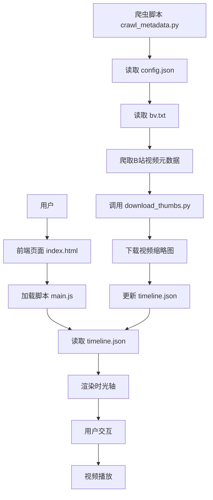

# 时光视频集 (Mohen Time Video Collection) 项目分析文档

## 1. 仓库概览

时光视频集是一个基于网页的视频时光轴展示系统，主要用于展示和管理主播视频的时光轴集合，方便粉丝群体了解主播的视频历史。

### 主要功能与亮点
- 从B站(Bilibili)爬取视频元数据（标题、发布时间）
- 自动下载和管理视频缩略图
- 以时光轴形式展示视频历史，带有动画效果
- 响应式设计，支持移动端浏览
- 美观的UI界面，采用电影胶片风格的设计元素
- 支持视频播放（使用B站官方嵌入播放器）
- 无版权字体，适合非商业用途

### 典型应用场景
- 粉丝群体收藏和回顾主播的视频历史
- 内容创作者整理自己的作品时间线
- 视频内容的时间顺序展示和管理

## 2. 目录结构

时光视频集项目采用清晰的目录结构，将前端和后端代码分离，便于维护和扩展。前端部分负责数据展示和用户交互，后端部分负责数据采集和处理。

```text
mohen-shiguang/
├── data/                # 数据目录
│   ├── bv.txt           # B站视频BV号列表
│   ├── config.json      # 爬虫配置文件
│   └── timeline.json    # 生成的时光轴数据
├── media/               # 媒体文件目录
│   └── thumbs/          # 缩略图存储目录
├── scripts/             # 前端脚本目录
│   └── main.js          # 主JavaScript文件
├── styles/              # 样式目录
│   └── main.css         # 主CSS文件
├── .gitignore           # Git忽略文件
├── README.md            # 项目说明
├── crawl_metadata.py    # 视频元数据爬虫
├── download_thumbs.py   # 缩略图下载脚本
└── index.html           # 主页面
```

### 目录职责说明

| 目录/文件              | 职责说明                                      |
|---------------------|-------------------------------------------|
| data/               | 存储配置文件和生成的数据                              |
| data/config.json    | 爬虫配置，包括用户代理、延迟时间、超时设置等                    |
| data/timeline.json  | 生成的时光轴数据，包含视频标题、发布时间、URL和缩略图路径等        |
| media/thumbs/       | 存储下载的视频缩略图                               |
| scripts/main.js     | 前端逻辑，负责加载和渲染时光轴数据，处理用户交互                |
| styles/main.css     | 前端样式，定义页面布局、动画效果和响应式设计                  |
| crawl_metadata.py   | 视频元数据爬虫，从B站爬取视频标题和发布时间                   |
| download_thumbs.py  | 缩略图下载脚本，自动下载和处理视频缩略图                    |
| index.html          | 主页面，时光轴展示的入口                             |

## 3. 系统架构与主流程

时光视频集项目采用前后端分离的架构设计，后端使用Python脚本进行数据采集和处理，前端使用HTML5、CSS3和JavaScript进行数据展示和用户交互。

### 系统架构图



### 主要数据流

1. **数据采集流程**
   - 用户编辑 `data/bv.txt` 文件，添加要爬取的B站视频URL
   - 运行 `crawl_metadata.py` 脚本
   - 脚本读取 `config.json` 配置和 `bv.txt` 中的URL
   - 爬取B站视频元数据（标题、发布时间）
   - 调用 `download_thumbs.py` 下载视频缩略图
   - 生成或更新 `timeline.json` 文件

2. **数据展示流程**
   - 用户访问 `index.html` 页面
   - 页面加载 `main.js` 脚本
   - 脚本读取 `timeline.json` 数据
   - 以时光轴形式渲染视频数据
   - 用户点击卡片或时间线点，触发视频播放

### 系统分层

- **数据采集层**：Python爬虫脚本，负责从B站获取视频元数据和缩略图
- **数据存储层**：JSON文件，存储配置信息和时光轴数据
- **前端展示层**：HTML、CSS和JavaScript，负责数据渲染和用户交互
- **用户交互层**：时光轴界面、视频播放器，提供用户操作入口

## 4. 核心功能模块

### 4.1 视频元数据爬虫模块

**功能说明**：从B站爬取视频的标题和发布时间等元数据信息。

**实现原理**：
- 使用 `requests` 库发送HTTP请求获取B站视频页面
- 使用 `BeautifulSoup4` 库解析HTML页面内容
- 从多个位置提取视频标题和发布时间
- 当无法获取发布时间时，使用当前日期作为默认值

**关键代码**：
```python
# crawl_metadata.py 中的视频元数据爬取函数
def crawl_video_metadata(self, url):
    max_retries = self.config['crawler']['max_retries']
    timeout = self.config['crawler']['timeout']
    
    for retry in range(max_retries):
        try:
            print(f"爬取视频：{url} (尝试 {retry+1}/{max_retries})")
            response = requests.get(url, headers=self.headers, timeout=timeout)
            response.raise_for_status()
            
            soup = BeautifulSoup(response.text, 'html.parser')
            
            # 提取视频元数据
            metadata = {
                'url': url,
                'type': 'bilibili',
                'title': self._extract_title(soup),
                'description': '',  # 默认设置为空
                'publish_date': self._extract_publish_date(soup)
            }
            
            print(f"成功爬取视频：{metadata['title']}")
            return metadata
            
        except requests.exceptions.RequestException as e:
            print(f"网络错误：{e}")
            if retry < max_retries - 1:
                print(f"等待 {self.config['crawler']['delay_seconds']} 秒后重试...")
                time.sleep(self.config['crawler']['delay_seconds'])
            else:
                print(f"错误：爬取 {url} 失败，已达到最大重试次数")
                return None
        except Exception as e:
            print(f"解析错误：{e}")
            return None
```

### 4.2 缩略图下载模块

**功能说明**：自动从B站视频页面下载视频缩略图，并更新时光轴数据中的缩略图路径。

**实现原理**：
- 从视频页面提取 og:image 或 twitter:image 元数据
- 确保URL协议正确
- 下载缩略图到本地存储
- 计算相对路径并更新 timeline.json 文件

**关键代码**：
```python
# download_thumbs.py 中的缩略图下载函数
def download_binary(url: str, outpath: Path):
    headers = {"User-Agent": "Mozilla/5.0 (thumb-fetcher)"}
    with requests.get(url, headers=headers, stream=True, timeout=20) as r:
        r.raise_for_status()
        outpath.parent.mkdir(parents=True, exist_ok=True)
        with outpath.open("wb") as f:
            for chunk in r.iter_content(chunk_size=8192):
                if chunk:
                    f.write(chunk)
```

### 4.3 时光轴展示模块

**功能说明**：以时光轴形式展示视频历史，支持动画效果和响应式设计。

**实现原理**：
- 加载 timeline.json 数据
- 动态生成时间线点和卡片
- 实现平滑滚动和动画效果
- 响应式设计，适配不同屏幕尺寸

**关键代码**：
```javascript
// main.js 中的时光轴渲染函数
function render(data) {
  const cardsCol = document.getElementById('cards-col');

  // 创建贯穿所有时间线项的垂直线
  const timelineLine = document.createElement('div');
  timelineLine.className = 'timeline-line';
  cardsCol.appendChild(timelineLine);

  data.events.forEach((ev, idx) => {
    // 创建时间线项容器，包含时间线点和卡片
    const timelineItem = document.createElement('div');
    timelineItem.className = 'timeline-item';
    timelineItem.dataset.index = idx;

    // 创建时间线点
    const point = document.createElement('div');
    point.className = 'timeline-point stagger-in';
    point.style.animationDelay = `${idx * 0.1}s`;
    point.dataset.index = idx;
    point.title = ev.text && ev.text.headline ? ev.text.headline : '事件';
    
    const dot = document.createElement('div');
    dot.className = 'dot';
    point.appendChild(dot);
    
    // 添加日期标签
    const dateLabel = document.createElement('div');
    dateLabel.className = 'date-label';
    dateLabel.textContent = formatDate(ev.start_date);
    point.appendChild(dateLabel);
    
    point.addEventListener('click', () => {
      scrollToCard(idx);
      activateCard(idx, true);
    });

    // 创建卡片
    const card = document.createElement('article');
    card.className = 'card stagger-in';
    card.style.animationDelay = `${idx * 0.15}s`;
    card.dataset.index = idx;
    card.setAttribute('role','listitem');

    // ... 卡片内容创建代码 ...

    card.addEventListener('click', () => activateCard(idx, true));

    // 将时间线点和卡片添加到时间线项容器中
    timelineItem.appendChild(point);
    timelineItem.appendChild(card);

    // 将时间线项添加到卡片列中
    cardsCol.appendChild(timelineItem);
  });
}
```

### 4.4 视频播放模块

**功能说明**：支持视频播放，使用B站官方嵌入播放器。

**实现原理**：
- 解析视频URL，提取BV号
- 创建B站播放器iframe
- 支持自动播放和全屏
- 实现弹窗播放模式

**关键代码**：
```javascript
// main.js 中的视频播放函数
function loadMediaIntoPlayer(media, autoplay){
  if (!modalPlayer) return;
  modalPlayer.innerHTML = '';

  const url = media.url || '';
  if (!url) {
    const ph = document.createElement('div');
    ph.className = 'placeholder';
    ph.innerText = '无媒体 URL';
    modalPlayer.appendChild(ph);
    openModal();
    return;
  }

  if ((media.type && media.type.toLowerCase()==='mp4') || url.match(/\.mp4(\?.*)?$/i)) {
    const video = document.createElement('video');
    video.controls = true;
    video.playsInline = true;
    video.preload = 'metadata';
    video.src = url;
    if (autoplay) video.autoplay = true;
    modalPlayer.appendChild(video);
    openModal();
    return;
  }

  if (url.includes('bilibili.com') || (media.type && media.type.toLowerCase()==='bilibili')) {
    const b = extractBVID(url);
    if (b && typeof b === 'string') {
      const iframe = document.createElement('iframe');
      const src = 'https://player.bilibili.com/player.html?bvid=' + encodeURIComponent(b) + '&page=1' + (autoplay ? '&autoplay=1' : '');
      iframe.src = src;
      iframe.allow = 'autoplay; fullscreen';
      modalPlayer.appendChild(iframe);
      openModal();
      return;
    }
    // ... 其他视频类型处理 ...
  }

  // ... 其他URL处理 ...
}
```

## 5. 核心 API/类/函数

### 5.1 VideoCrawler 类

**功能**：视频元数据爬虫类，负责从B站爬取视频元数据并生成时光轴数据。

**主要方法**：
- `__init__(config_path, bv_file_path)`：初始化爬虫，加载配置文件
- `_load_config()`：加载配置文件
- `_save_config()`：保存配置文件
- `_load_bv_file()`：从 bv.txt 文件读取 URL
- `_merge_urls()`：合并 bv.txt 中的 URL 到 config.json 的 targets
- `check_robots(url)`：检查 robots.txt 协议
- `crawl_video_metadata(url)`：爬取视频元数据
- `_extract_title(soup)`：提取视频标题
- `_extract_publish_date(soup)`：提取视频发布时间
- `load_existing_timeline(output_path)`：加载现有的 timeline.json 文件
- `get_existing_urls(timeline_data)`：从现有 timeline 数据中提取已存在的 URL
- `generate_timeline(output_path)`：生成 timeline.json 文件

**应用场景**：当需要批量爬取B站视频元数据并生成时光轴数据时使用。

### 5.2 download_thumbs.py 模块

**功能**：下载和管理视频缩略图。

**主要函数**：
- `get_og_image(html)`：从HTML中提取og:image或twitter:image
- `sanitize_ext(pathname)`：清理文件扩展名
- `ensure_protocol(url)`：确保URL有正确的协议头
- `choose_filename(url, idx, ext)`：选择缩略图文件名
- `download_binary(url, outpath)`：下载二进制文件
- `main()`：主函数，处理命令行参数和执行流程

**应用场景**：当需要为时光轴中的视频下载和更新缩略图时使用。

### 5.3 main.js 模块

**功能**：前端主脚本，负责加载和渲染时光轴数据，处理用户交互。

**主要函数**：
- `fetchTimeline()`：加载 timeline.json 数据
- `loadTimeline()`：加载时光轴数据并渲染
- `render(data)`：渲染时光轴数据
- `formatDate(sd)`：格式化日期
- `scrollToCard(idx)`：滚动到指定卡片
- `extractBVID(url)`：从URL中提取BV号
- `activateCard(idx, autoplay)`：激活指定卡片并播放视频
- `loadMediaIntoPlayer(media, autoplay)`：加载媒体到播放器
- `initModal()`：初始化弹窗播放器

**应用场景**：在浏览器中展示时光轴数据并处理用户交互时使用。

### 5.4 数据结构

**timeline.json 结构**：

```json
{
  "title": {
    "media": {
      "url": "",
      "caption": "",
      "credit": ""
    },
    "text": {
      "headline": "水墨风 视频时间线（Bilibili 示例）",
      "text": "点击卡片将在上方播放器中使用 B 站官方播放器播放视频（player.bilibili.com）。"
    }
  },
  "events": [
    {
      "start_date": {
        "year": "2014",
        "month": "05"
      },
      "text": {
        "headline": "洞主20140502 早期余小C：爱情娱乐而已",
        "text": ""
      },
      "media": {
        "url": "https://www.bilibili.com/video/BV1gk4y1r77A",
        "type": "bilibili",
        "thumbnail": "media/thumbs/BV1gk4y1r77A-0.jpg"
      }
    }
  ]
}
```

**config.json 结构**：

```json
{
  "targets": [
    {
      "url": "https://www.bilibili.com/video/BV1gk4y1r77A",
      "crawled": true
    }
  ],
  "crawler": {
    "user_agent": "Mozilla/5.0 (Windows NT 10.0; Win64; x64) AppleWebKit/537.36 (KHTML, like Gecko) Chrome/91.0.4472.124 Safari/537.36",
    "delay_seconds": 1.0,
    "timeout": 15,
    "max_retries": 3
  },
  "output": {
    "title": "水墨风 视频时间线（Bilibili 示例）",
    "description": "点击卡片将在上方播放器中使用 B 站官方播放器播放视频（player.bilibili.com）。"
  }
}
```

## 6. 技术栈与依赖

### 6.1 前端技术栈

| 技术/框架 | 版本/说明 | 用途 | 来源 |
|---------|---------|------|------|
| HTML5   | 标准    | 页面结构 | index.html |
| CSS3    | 标准    | 页面样式和动画 | styles/main.css |
| JavaScript | ES6+ | 前端交互逻辑 | scripts/main.js |
| Bilibili Player | 官方嵌入版 | 视频播放 | 通过iframe嵌入 |

### 6.2 后端技术栈

| 技术/框架 | 版本/说明 | 用途 | 来源 |
|---------|---------|------|------|
| Python | 3.6+ | 后端脚本开发 | crawl_metadata.py, download_thumbs.py |
| requests | 第三方库 | HTTP请求 | crawl_metadata.py:25 |
| BeautifulSoup4 | 第三方库 | HTML解析 | crawl_metadata.py:26 |
| JSON | 标准格式 | 数据存储和传输 | 多个文件 |

### 6.3 依赖管理

项目使用Python的pip包管理器来安装依赖：

```bash
pip install requests beautifulsoup4
```

## 7. 关键模块与典型用例

### 7.1 视频元数据爬取

**功能说明**：从B站爬取视频元数据并生成时光轴数据。

**配置与依赖**：
- 配置文件：`data/config.json`
- 依赖库：requests, beautifulsoup4
- 输入文件：`data/bv.txt`

**使用示例**：

1. 编辑 `data/bv.txt` 文件，添加要爬取的B站视频URL：

```text
https://www.bilibili.com/video/BV1gk4y1r77A
https://www.bilibili.com/video/BV1Q7411E7X4
```

2. 运行爬虫脚本：

```bash
python crawl_metadata.py
```

3. 脚本会自动：
   - 爬取视频元数据
   - 下载视频缩略图
   - 生成或更新 `timeline.json` 文件

### 7.2 时光轴展示与视频播放

**功能说明**：以时光轴形式展示视频历史，并支持视频播放。

**配置与依赖**：
- 数据文件：`data/timeline.json`
- 前端文件：`index.html`, `styles/main.css`, `scripts/main.js`

**使用示例**：

1. 启动本地HTTP服务器：

```bash
python -m http.server 8000
```

2. 通过浏览器访问：
   - 打开任何现代浏览器（Chrome、Firefox、Edge等）
   - 在地址栏输入 `http://localhost:8000` 并按回车
   - 浏览器会加载 `index.html` 页面，显示时光视频集的时光轴效果

3. 交互操作：
   - 点击时间线点或卡片，触发视频播放
   - 滚动页面，查看更多视频
   - 在移动设备上，页面会自动适配屏幕尺寸

### 7.3 添加新视频

**功能说明**：向时光轴中添加新的视频。

**配置与依赖**：
- 输入文件：`data/bv.txt`
- 依赖库：requests, beautifulsoup4

**使用示例**：

1. 编辑 `data/bv.txt` 文件，在末尾添加新的视频URL：

```text
https://www.bilibili.com/video/BV1gk4y1r77A
https://www.bilibili.com/video/BV1Q7411E7X4
https://www.bilibili.com/video/BV1Wo4y1o7HZ
```

2. 重新运行爬虫脚本：

```bash
python crawl_metadata.py
```

3. 刷新浏览器页面 (`http://localhost:8000`) 查看更新后的时光轴

## 8. 配置、部署与开发

### 8.1 环境准备

1. **安装Python**
   - 确保安装了 Python 3.6 或更高版本
   - 可从 [Python官网](https://www.python.org/downloads/) 下载并安装

2. **安装依赖**
   - 打开命令行终端
   - 进入项目目录
   - 运行以下命令安装依赖：

   ```bash
   pip install requests beautifulsoup4
   ```

### 8.2 配置文件

**config.json**：爬虫配置文件，包含以下配置项：

- `targets`：目标视频URL列表，包含已爬取状态
- `crawler`：爬虫配置
  - `user_agent`：用户代理字符串
  - `delay_seconds`：请求延迟时间（秒）
  - `timeout`：请求超时时间（秒）
  - `max_retries`：最大重试次数
- `output`：输出配置
  - `title`：时光轴标题
  - `description`：时光轴描述

**bv.txt**：B站视频URL列表，每行一个URL

### 8.3 部署方式

时光视频集项目是一个静态网站，部署非常简单：

1. **本地部署**：
   - 启动本地HTTP服务器：`python -m http.server 8000`
   - 通过浏览器访问：`http://localhost:8000`

2. **远程部署**：
   - 将项目文件上传到Web服务器
   - 确保服务器支持静态文件访问
   - 通过服务器域名或IP地址访问

### 8.4 开发流程

1. **添加新功能**：
   - 前端修改：编辑 `index.html`, `styles/main.css`, `scripts/main.js`
   - 后端修改：编辑 `crawl_metadata.py`, `download_thumbs.py`

2. **测试**：
   - 运行爬虫脚本测试数据采集
   - 启动本地服务器测试前端展示
   - 在不同设备和浏览器中测试响应式设计

3. **维护**：
   - 定期更新 `bv.txt` 文件，添加新视频
   - 重新运行爬虫脚本更新数据
   - 检查并修复可能的爬取错误

## 9. 监控与维护

### 9.1 爬虫监控

- **日志输出**：爬虫脚本会在控制台输出详细的日志信息，包括爬取状态、错误信息等
- **错误处理**：脚本包含错误处理机制，当爬取失败时会输出错误信息并继续处理其他URL
- **重试机制**：当网络错误时，脚本会自动重试，最多重试3次

### 9.2 常见问题与解决方案

| 问题 | 原因 | 解决方案 |
|------|------|---------|
| 爬取失败 | 网络错误或B站页面结构变化 | 检查网络连接，更新爬虫脚本 |
| 缩略图下载失败 | 网络错误或图片URL无效 | 检查网络连接，手动下载缩略图 |
| 时光轴不显示 | timeline.json文件不存在或格式错误 | 重新运行爬虫脚本生成数据 |
| 视频无法播放 | B站播放器嵌入限制或URL错误 | 检查视频URL是否有效，确保B站允许嵌入 |
| 响应式设计问题 | 浏览器兼容性问题 | 测试在不同浏览器和设备上的显示效果 |

### 9.3 维护建议

- **定期更新**：定期添加新视频并更新时光轴数据
- **备份数据**：定期备份 `data/timeline.json` 和 `media/thumbs` 目录
- **监控爬虫**：关注爬虫脚本的运行状态，及时处理爬取错误
- **优化性能**：对于大量视频，考虑优化爬虫性能和前端渲染速度

## 10. 总结与亮点回顾

时光视频集项目是一个功能完整、设计美观的视频时光轴展示系统，具有以下亮点：

### 10.1 技术亮点

- **前后端分离架构**：后端使用Python爬虫脚本进行数据采集，前端使用原生HTML5、CSS3和JavaScript进行数据展示，架构清晰，易于维护
- **响应式设计**：采用CSS3媒体查询和弹性布局，适配不同屏幕尺寸，提供良好的移动端体验
- **动画效果**：使用CSS3动画和过渡效果，增强用户体验，使时光轴展示更加生动
- **模块化设计**：代码组织模块化，职责分明，便于扩展和维护
- **错误处理**：爬虫脚本包含完善的错误处理和重试机制，提高爬取成功率

### 10.2 功能亮点

- **自动数据采集**：通过Python爬虫自动从B站获取视频元数据和缩略图，减少手动操作
- **时光轴展示**：以时间顺序展示视频历史，直观清晰
- **视频播放**：集成B站官方播放器，支持自动播放和全屏
- **用户交互**：支持点击卡片、时间线点触发视频播放，提供良好的用户体验
- **数据管理**：通过JSON文件管理配置和数据，结构清晰，易于理解

### 10.3 应用价值

- **粉丝工具**：为粉丝群体提供了一个方便的方式来收藏和回顾主播的视频历史
- **内容管理**：为内容创作者提供了一个整理自己作品时间线的工具
- **学习资源**：项目代码结构清晰，适合作为前端和Python爬虫学习的参考资料
- **非商业用途**：使用无版权字体，适合非商业目的的使用

### 10.4 未来展望

- **功能扩展**：可以考虑添加视频分类、搜索功能、评论系统等
- **性能优化**：对于大量视频数据，可以考虑使用数据库存储，提高查询和渲染速度
- **用户体验**：可以添加更多交互效果和个性化设置
- **多平台支持**：可以考虑支持其他视频平台，如YouTube、腾讯视频等

时光视频集项目通过简洁的设计和实用的功能，为视频内容的时间顺序展示提供了一个优雅的解决方案，是一个兼具技术价值和应用价值的开源项目。